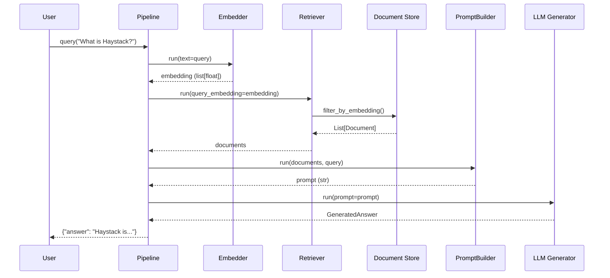

# Haystack Framework - Tổng Quan Kiến Trúc

## Giới thiệu

**Haystack** là một framework LLM end-to-end mã nguồn mở được phát triển bởi deepset, cho phép xây dựng các ứng dụng AI sử dụng Large Language Models (LLMs), mô hình Transformer, vector search và nhiều công nghệ khác.

### Các use-case chính:
- Retrieval-Augmented Generation (RAG)
- Document Search
- Question Answering
- Text Generation với LLMs
- Agent-based Systems

---

## Sơ đồ Kiến Trúc Tổng Quan

```
┌─────────────────────────────────────────────────────────────────────────┐
│                         USER APPLICATION                                │
└─────────────────────────────────┬───────────────────────────────────────┘
                                  │
                                  ▼
┌─────────────────────────────────────────────────────────────────────────┐
│                    LAYER 1: CORE FRAMEWORK                              │
│                         (haystack/core/)                                │
│  ┌─────────────────┐  ┌─────────────────┐  ┌─────────────────────────┐  │
│  │   Component     │  │    Pipeline     │  │   SuperComponent        │  │
│  │   Decorator     │  │  Orchestration  │  │   (Composite Pattern)   │  │
│  └─────────────────┘  └─────────────────┘  └─────────────────────────┘  │
└─────────────────────────────────┬───────────────────────────────────────┘
                                  │
                                  ▼
┌─────────────────────────────────────────────────────────────────────────┐
│                    LAYER 2: DATA TYPES                                  │
│                      (haystack/dataclasses/)                            │
│  ┌──────────┐  ┌─────────────┐  ┌────────┐  ┌───────────────────────┐   │
│  │ Document │  │ ChatMessage │  │ Answer │  │ ToolCall/ToolResult   │   │
│  └──────────┘  └─────────────┘  └────────┘  └───────────────────────┘   │
└─────────────────────────────────┬───────────────────────────────────────┘
                                  │
                                  ▼
┌─────────────────────────────────────────────────────────────────────────┐
│                    LAYER 3: COMPONENTS                                  │
│                      (haystack/components/)                             │
│  ┌───────────┐ ┌────────────┐ ┌───────────┐ ┌─────────┐ ┌────────────┐  │
│  │ Embedders │ │ Generators │ │ Retrievers│ │ Rankers │ │  Builders  │  │
│  └───────────┘ └────────────┘ └───────────┘ └─────────┘ └────────────┘  │
│  ┌───────────┐ ┌────────────┐ ┌───────────┐ ┌─────────┐ ┌────────────┐  │
│  │  Writers  │ │  Readers   │ │ Converters│ │ Routers │ │   Agents   │  │
│  └───────────┘ └────────────┘ └───────────┘ └─────────┘ └────────────┘  │
└─────────────────────────────────┬───────────────────────────────────────┘
                                  │
                                  ▼
┌─────────────────────────────────────────────────────────────────────────┐
│                    LAYER 4: INFRASTRUCTURE                              │
│  ┌─────────────────┐  ┌─────────────────┐  ┌─────────────────────────┐  │
│  │ Document Stores │  │ Tools/Toolsets  │  │  Evaluation Framework   │  │
│  │(document_stores)│  │    (tools/)     │  │    (evaluation/)        │  │
│  └─────────────────┘  └─────────────────┘  └─────────────────────────┘  │
│  ┌─────────────────┐  ┌─────────────────┐  ┌─────────────────────────┐  │
│  │    Utilities    │  │  Tracing/Logs   │  │     Telemetry           │  │
│  │    (utils/)     │  │   (tracing/)    │  │    (telemetry/)         │  │
│  └─────────────────┘  └─────────────────┘  └─────────────────────────┘  │
└─────────────────────────────────────────────────────────────────────────┘
```

---

## Chi Tiết Các Layer

### Layer 1: Core Framework (`haystack/core/`)

**Chức năng:** Cung cấp nền tảng cơ bản cho toàn bộ framework, bao gồm hệ thống component và pipeline orchestration.

| Thư mục/File | Mô tả |
|--------------|-------|
| `core/component/` | Hệ thống decorator `@component` và class `Component` base |
| `core/pipeline/` | Pipeline orchestration (sync & async) dựa trên DAG (Directed Acyclic Graph) |
| `core/super_component/` | SuperComponent - cho phép wrap pipeline thành một component đơn lẻ |
| `core/serialization.py` | Serialization/deserialization cho components và pipelines |
| `core/type_utils.py` | Type checking và validation |

**Design Patterns sử dụng:**
- **Decorator Pattern:** `@component` decorator
- **DAG Pattern:** Pipeline orchestration sử dụng networkx
- **Composite Pattern:** SuperComponent

---

### Layer 2: Data Types (`haystack/dataclasses/`)

**Chức năng:** Định nghĩa các kiểu dữ liệu cơ bản được sử dụng xuyên suốt framework.

| File | Class chính | Mô tả |
|------|-------------|-------|
| `document.py` | `Document` | Đơn vị dữ liệu cơ bản, chứa content, metadata, embedding, blob |
| `chat_message.py` | `ChatMessage`, `ChatRole` | Message trong conversation, hỗ trợ roles: user, assistant, system, tool |
| `answer.py` | `Answer`, `ExtractedAnswer`, `GeneratedAnswer` | Các loại câu trả lời từ hệ thống |
| `tool.py` | `ToolCall`, `ToolCallResult` | Dữ liệu liên quan đến tool calls trong agent system |
| `streaming_chunk.py` | `StreamingChunk` | Hỗ trợ streaming response từ LLMs |
| `byte_stream.py` | `ByteStream` | Xử lý binary data |
| `sparse_embedding.py` | `SparseEmbedding` | Sparse embeddings cho retrieval |

**Design Patterns sử dụng:**
- **Data Transfer Object (DTO):** Các dataclass đóng vai trò DTO
- **Immutable Objects:** Sử dụng Python dataclasses với tính bất biến

---

### Layer 3: Components (`haystack/components/`)

**Chức năng:** Cung cấp các component tái sử dụng, sẵn sàng để plug vào pipeline.

| Thư mục | Mô tả | Ví dụ Components |
|---------|-------|------------------|
| `embedders/` | Tạo embeddings cho text/documents | `SentenceTransformersTextEmbedder`, `OpenAITextEmbedder` |
| `generators/` | Text generation với LLMs | `OpenAIGenerator`, `HuggingFaceLocalGenerator` |
| `retrievers/` | Truy vấn documents từ store | `InMemoryBM25Retriever`, `InMemoryEmbeddingRetriever` |
| `rankers/` | Sắp xếp lại kết quả retrieval | `TransformersSimilarityRanker`, `LostInTheMiddleRanker` |
| `builders/` | Xây dựng prompts và answers | `PromptBuilder`, `AnswerBuilder`, `ChatPromptBuilder` |
| `writers/` | Ghi documents vào stores | `DocumentWriter` |
| `readers/` | Đọc và parse documents | `ExtractiveReader` |
| `converters/` | Chuyển đổi format | `HTMLToDocument`, `PDFMinerToDocument`, `MarkdownToDocument` |
| `preprocessors/` | Tiền xử lý documents | `DocumentSplitter`, `DocumentCleaner` |
| `routers/` | Điều hướng data flow | `ConditionalRouter`, `MetadataRouter` |
| `classifiers/` | Phân loại documents/queries | `DocumentLanguageClassifier` |
| `evaluators/` | Đánh giá kết quả | `AnswerExactMatchEvaluator`, `FaithfulnessEvaluator` |
| `joiners/` | Kết hợp nhiều inputs | `DocumentJoiner`, `BranchJoiner` |
| `validators/` | Validate inputs | `JsonSchemaValidator` |
| `agents/` | Agent implementations | `Agent` với tool calling |
| `tools/` | Tool-related components | `ToolInvoker` |
| `caching/` | Caching strategies | `CacheChecker`, `CacheWriter` |
| `fetchers/` | Fetch external data | `LinkContentFetcher` |
| `websearch/` | Web search capabilities | `SerperDevWebSearch` |
| `audio/` | Audio processing | `LocalWhisperTranscriber` |
| `extractors/` | Information extraction | `NamedEntityExtractor` |
| `samplers/` | Document sampling | `TopPSampler` |
| `connectors/` | External connectors | `OpenAPIServiceConnector` |

**Design Patterns sử dụng:**
- **Strategy Pattern:** Các loại embedders, generators khác nhau
- **Adapter Pattern:** Wrapping external APIs (OpenAI, HuggingFace, etc.)
- **Template Method:** Base classes cho từng loại component

---

### Layer 4: Infrastructure

**Chức năng:** Cung cấp các dịch vụ hỗ trợ cho toàn bộ framework.

#### 4.1 Document Stores (`haystack/document_stores/`)

| Thư mục/File | Mô tả |
|--------------|-------|
| `types/` | Protocol definitions cho document stores |
| `in_memory/` | In-memory implementation (reference implementation) |
| `errors/` | Exception classes |

#### 4.2 Tools (`haystack/tools/`)

| File | Mô tả |
|------|-------|
| `tool.py` | `Tool` dataclass - định nghĩa tool cho agents |
| `component_tool.py` | `ComponentTool` - wrap component thành tool |
| `pipeline_tool.py` | `PipelineTool` - wrap pipeline thành tool |
| `toolset.py` | `Toolset` - collection of tools |
| `from_function.py` | `@tool` decorator và `create_tool_from_function()` |

#### 4.3 Utilities (`haystack/utils/`)

| File | Mô tả |
|------|-------|
| `auth.py` | `Secret` class cho credential management |
| `device.py` | Device management (CPU/GPU) |
| `url_validation.py` | URL validation helpers |
| `requests_utils.py` | HTTP request utilities với retry |
| `type_serialization.py` | Type serialization/deserialization |
| `callable_serialization.py` | Function/callable serialization |
| `filters.py` | Document filtering utilities |
| `jupyter.py` | Jupyter notebook detection |

#### 4.4 Tracing (`haystack/tracing/`)

| File | Mô tả |
|------|-------|
| `tracer.py` | Base tracer interface |
| `opentelemetry.py` | OpenTelemetry integration |
| `datadog.py` | Datadog integration |
| `langfuse.py` | Langfuse integration |

#### 4.5 Evaluation (`haystack/evaluation/`)

| File | Mô tả |
|------|-------|
| `eval_run_result.py` | `EvaluationRunResult` class |

---

## Luồng Dữ Liệu Ví Dụ (RAG Pipeline)



---

## Thư Mục Phân Tích Chi Tiết

Xem chi tiết từng layer tại:
- [Core Framework](./core-framework/README.md)
- [Data Types](./data-types/README.md)
- [Components Layer](./components-layer/README.md)
- [Infrastructure Layer](./infrastructure-layer/README.md)
