# Sequence Diagrams - Luồng Hoạt Động Haystack

## 1. RAG Pipeline - Retrieval Augmented Generation

### 1.1 Basic RAG Flow

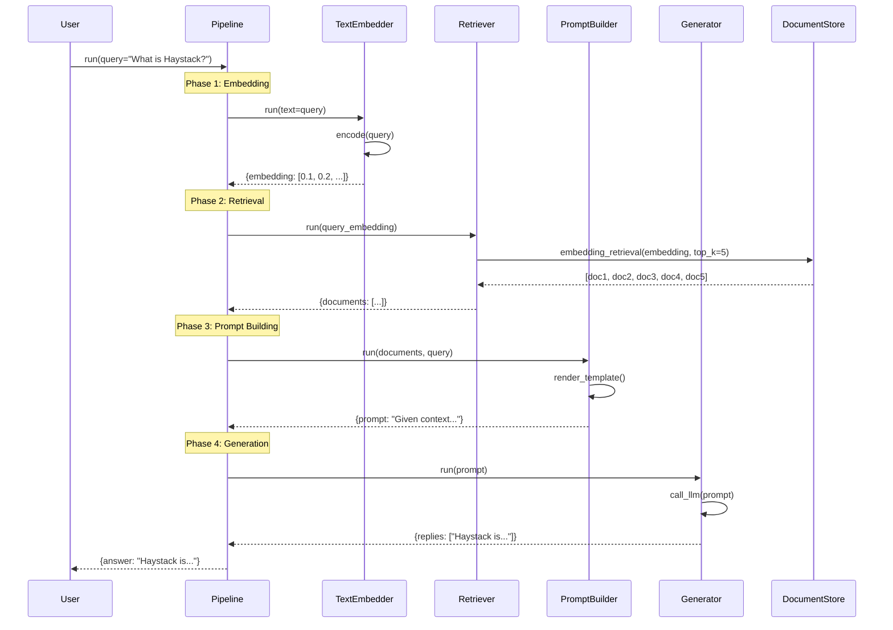

### 1.2 RAG với Ranker

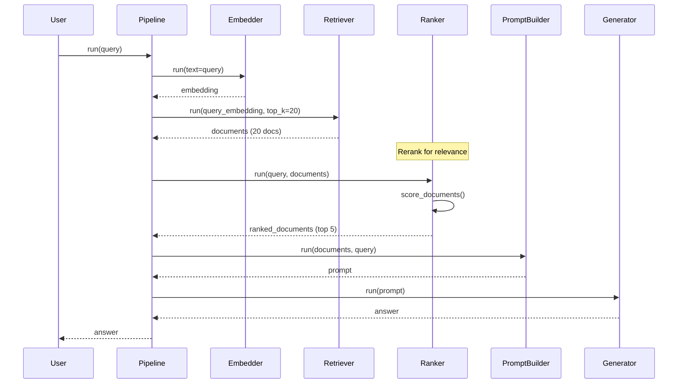

---

## 2. Document Ingestion Pipeline

### 2.1 Basic Document Ingestion

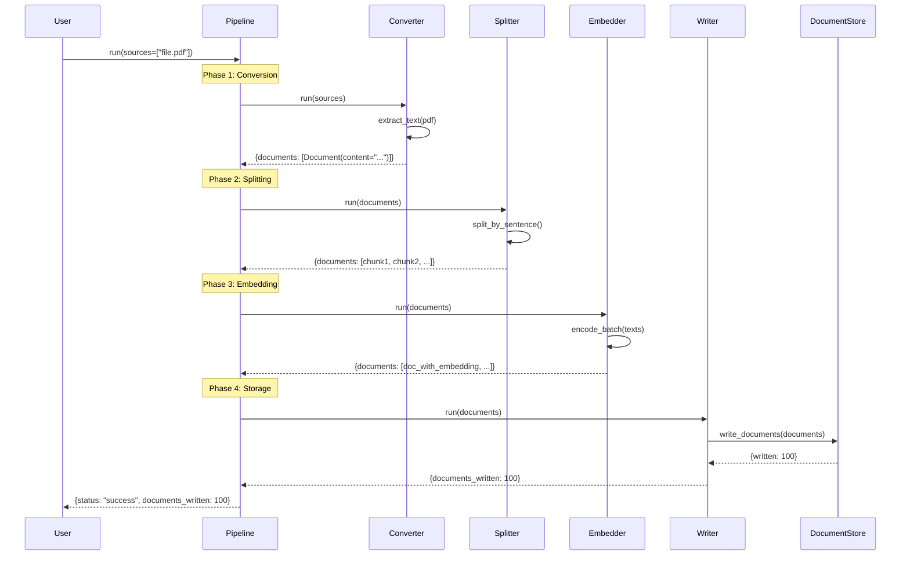

### 2.2 Multi-Format Document Ingestion

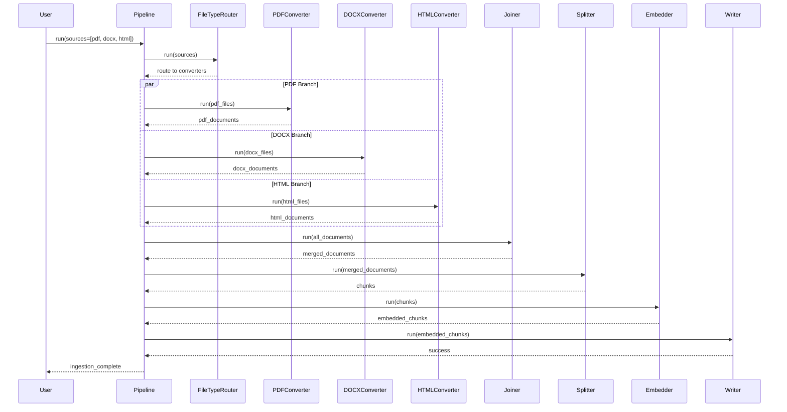

---

## 3. Chat Pipeline

### 3.1 Basic Chat Flow

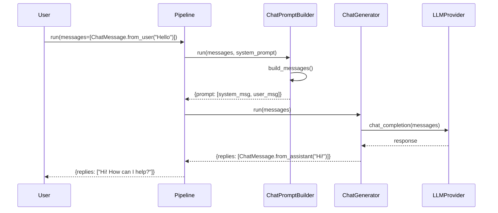

### 3.2 Chat với RAG Context

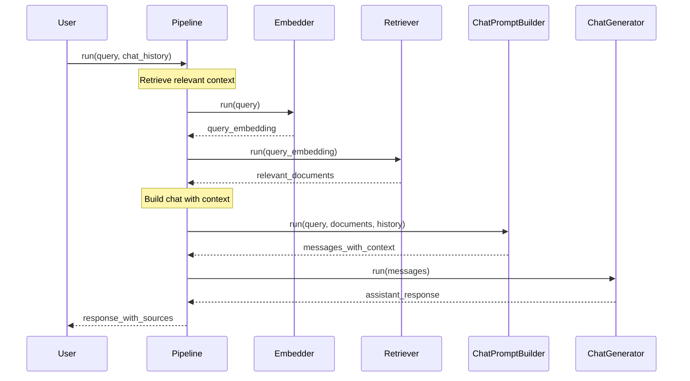

---

## 4. Agent Workflow

### 4.1 Agent với Tool Calling

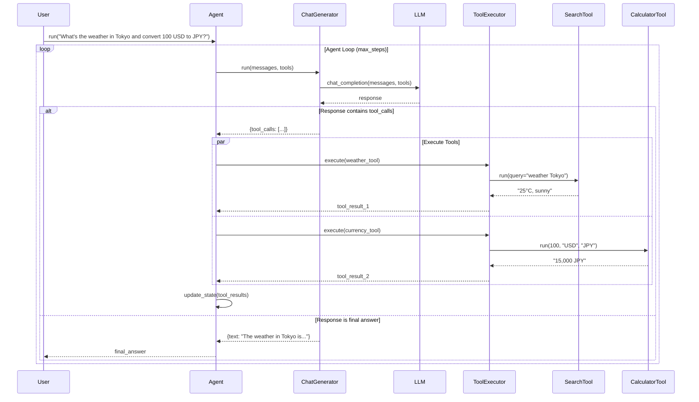

### 4.2 Agent State Management

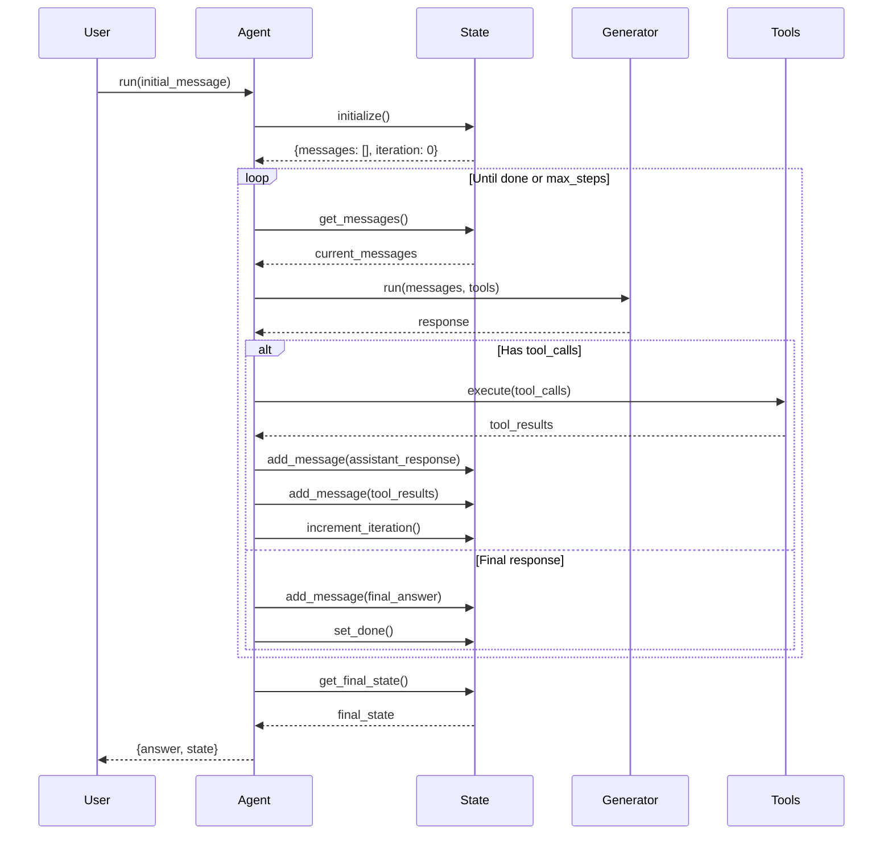

---

## 5. Component Lifecycle

### 5.1 Component Initialization & Execution

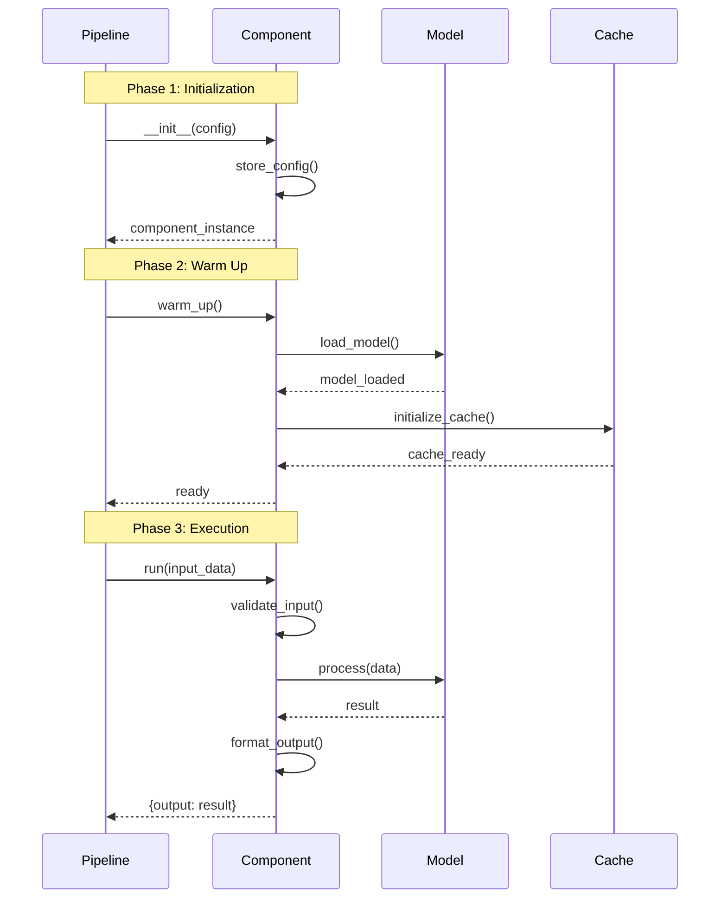

### 5.2 Pipeline Assembly & Validation

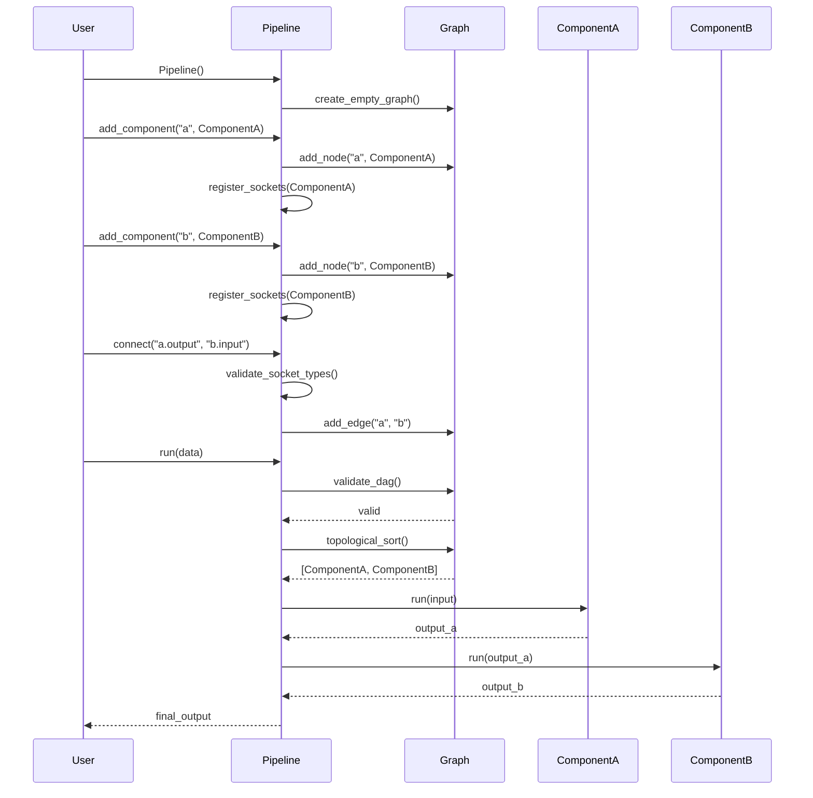

---

## 6. Serialization Flow

### 6.1 Pipeline Serialization

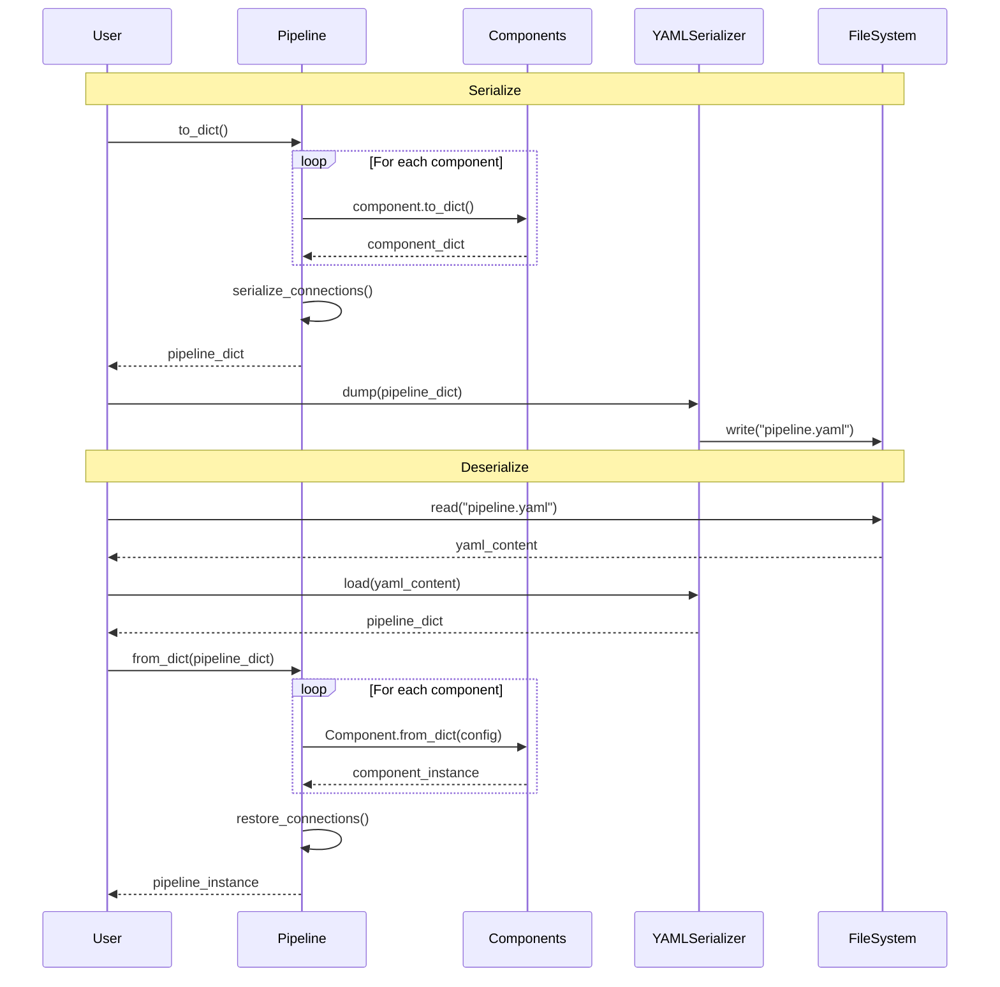

---

## 7. Tracing Flow

### 7.1 OpenTelemetry Tracing

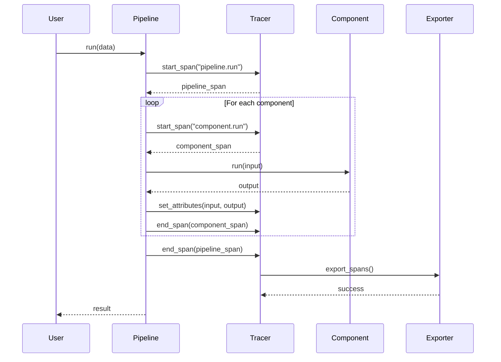

---

## 8. Error Handling Flow

### 8.1 Pipeline Error Recovery

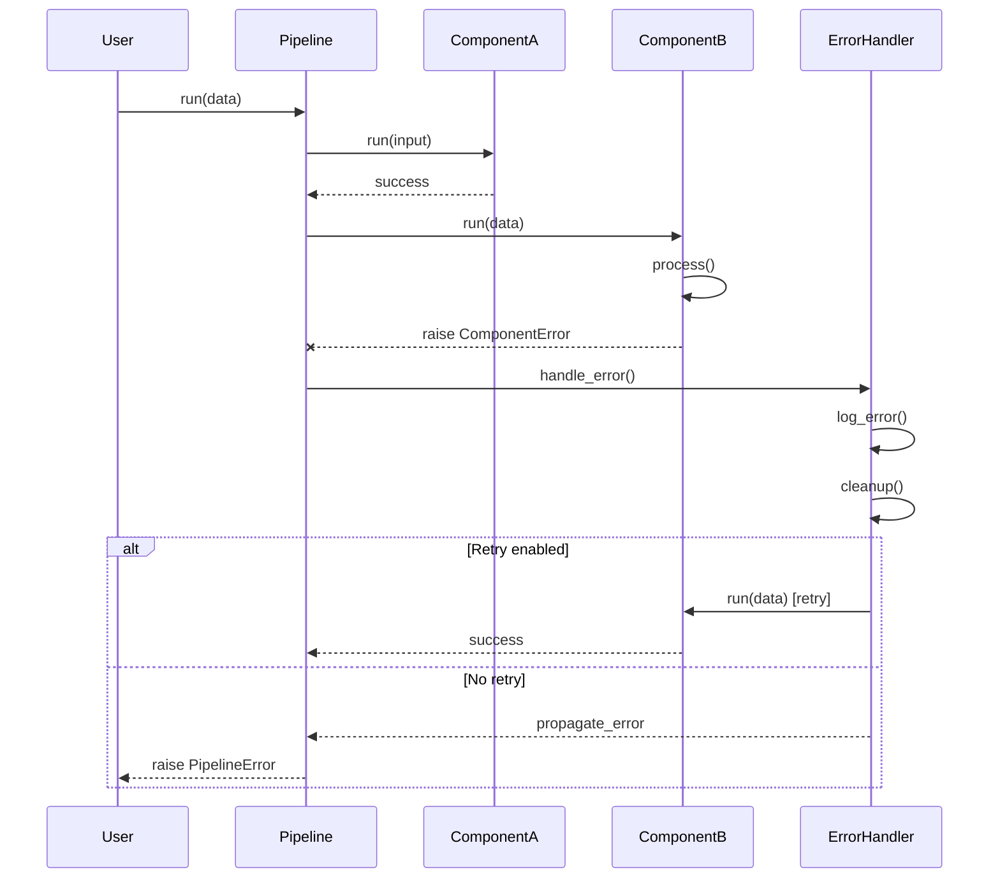

---

## 9. Async Pipeline Flow

### 9.1 Parallel Component Execution

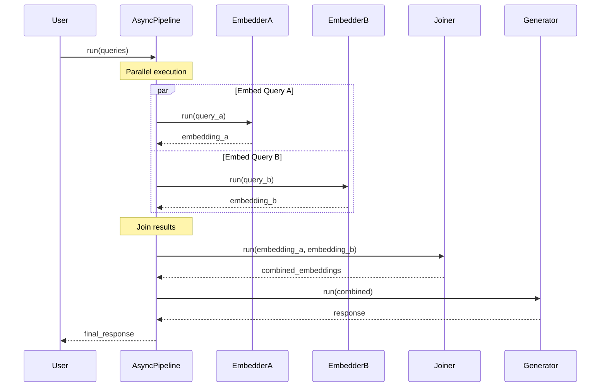

---

## 10. Evaluation Flow

### 10.1 RAG Evaluation Pipeline

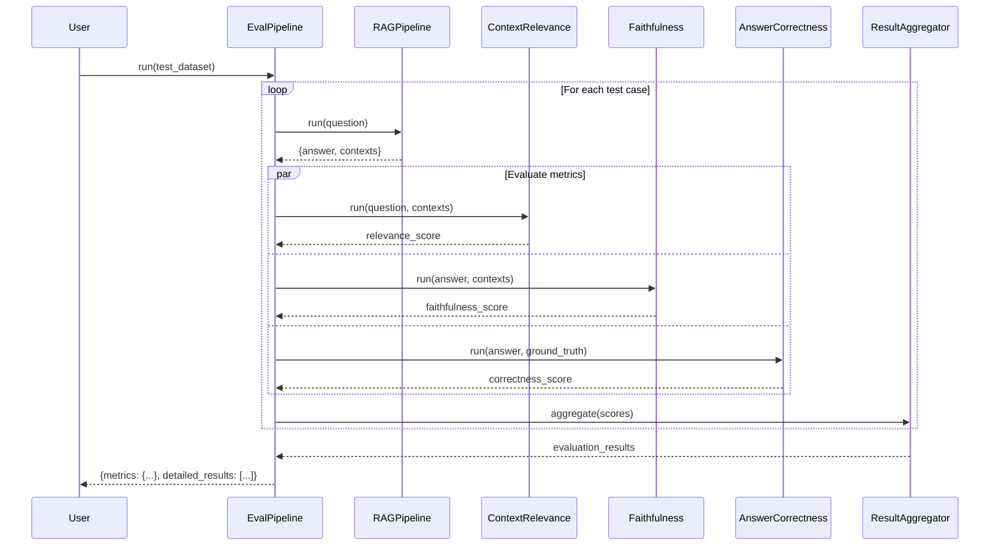
