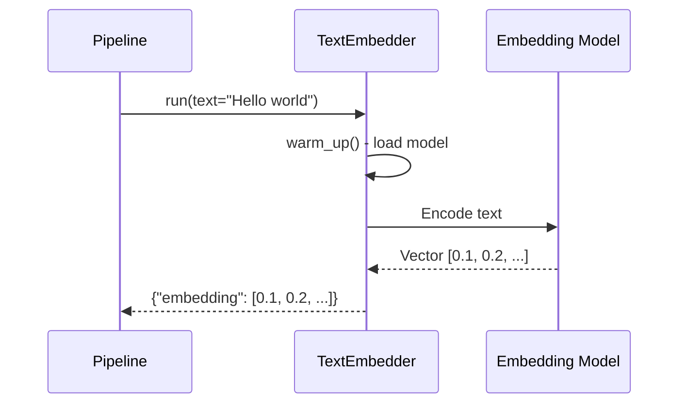
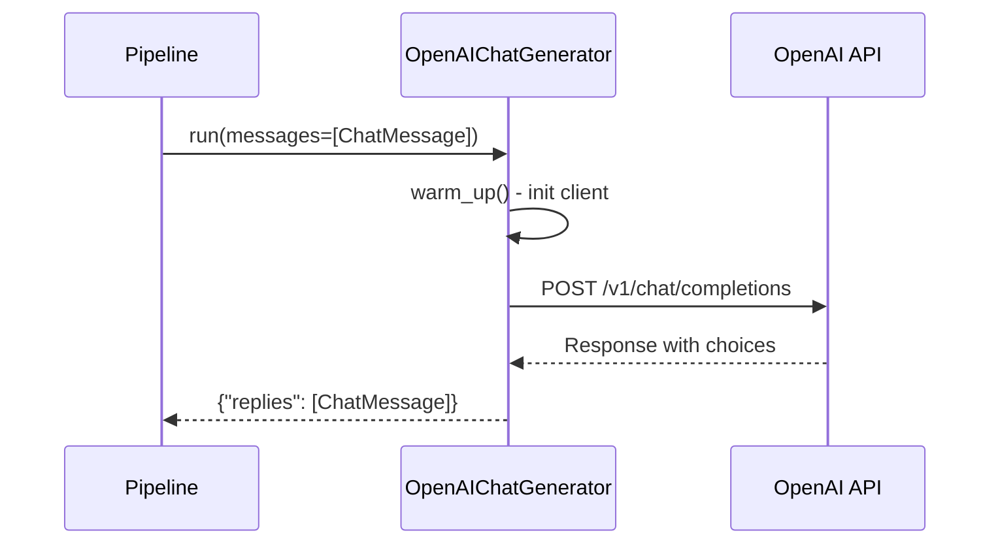
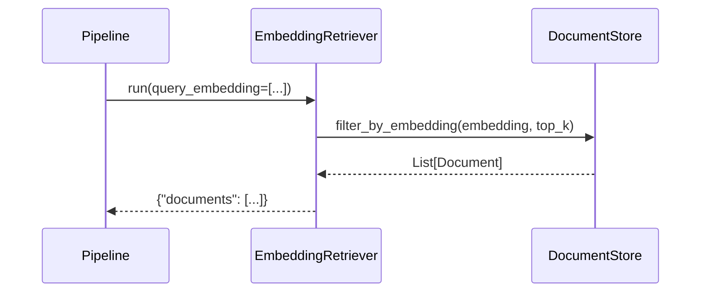
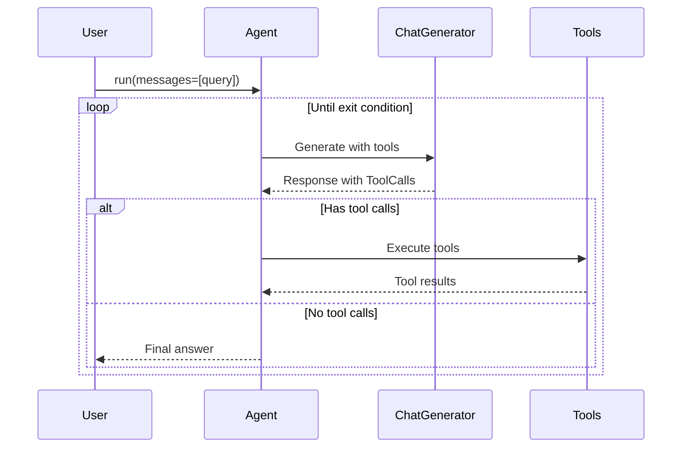
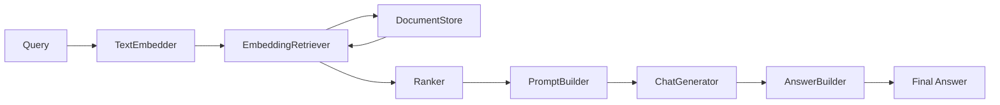

# Components Layer

## Tổng quan

Components Layer chứa tất cả các component tái sử dụng, sẵn sàng plug vào pipeline. Đây là layer lớn nhất với hơn 150 files trong thư mục `haystack/components/`.

## Cấu trúc thư mục

```
haystack/components/
├── agents/              # Agent implementations
├── audio/               # Audio processing (Whisper transcription)
├── builders/            # Prompt và answer builders
├── caching/             # Cache components
├── classifiers/         # Document/text classifiers
├── connectors/          # External API connectors
├── converters/          # Format converters (PDF, HTML, etc.)
├── embedders/           # Text/Document embedders
├── evaluators/          # Evaluation metrics
├── extractors/          # Information extractors
├── fetchers/            # URL/content fetchers
├── generators/          # Text generators (LLMs)
│   └── chat/            # Chat generators
├── joiners/             # Data joiners
├── preprocessors/       # Document preprocessors
├── query/               # Query expansion
├── rankers/             # Document rankers
├── readers/             # Extractive readers
├── retrievers/          # Document retrievers
├── routers/             # Dynamic routing
├── samplers/            # Document samplers
├── tools/               # Tool invokers
├── validators/          # Input validators
├── websearch/           # Web search components
└── writers/             # Document writers
```

---

## Phân loại Components theo Chức năng

### 1. Embedders (`embedders/`)

**Mục đích:** Chuyển đổi text/documents thành vector embeddings.

| Component | Mô tả |
|-----------|-------|
| `SentenceTransformersTextEmbedder` | Text embeddings với sentence-transformers |
| `SentenceTransformersDocumentEmbedder` | Document embeddings |
| `OpenAITextEmbedder` | OpenAI embeddings API |
| `OpenAIDocumentEmbedder` | OpenAI cho documents |
| `AzureOpenAITextEmbedder` | Azure OpenAI embeddings |
| `HuggingFaceAPITextEmbedder` | HuggingFace Inference API |
| `CohereTextEmbedder` | Cohere embeddings |
| `FastembedTextEmbedder` | FastEmbed library |
| `OllamaTextEmbedder` | Local Ollama embeddings |

**Sequence Diagram - Embedding Flow:**


---

### 2. Generators (`generators/`)

**Mục đích:** Text generation sử dụng LLMs.

| Component | Mô tả |
|-----------|-------|
| `OpenAIGenerator` | OpenAI GPT models |
| `AzureOpenAIGenerator` | Azure OpenAI |
| `HuggingFaceLocalGenerator` | Local HuggingFace models |
| `HuggingFaceAPIGenerator` | HuggingFace Inference API |
| `DALLEImageGenerator` | DALL-E image generation |

**Chat Generators (`generators/chat/`):**
| Component | Mô tả |
|-----------|-------|
| `OpenAIChatGenerator` | OpenAI chat models |
| `AzureOpenAIChatGenerator` | Azure OpenAI chat |
| `HuggingFaceAPIChatGenerator` | HuggingFace chat |

**Sequence Diagram - LLM Generation:**


---

### 3. Retrievers (`retrievers/`)

**Mục đích:** Truy vấn documents từ document stores.

| Component | Mô tả |
|-----------|-------|
| `InMemoryBM25Retriever` | BM25 retrieval từ InMemoryDocumentStore |
| `InMemoryEmbeddingRetriever` | Embedding-based retrieval |
| `FilterRetriever` | Retrieval với metadata filters |

**Sequence Diagram - Retrieval:**


---

### 4. Builders (`builders/`)

**Mục đích:** Xây dựng prompts và answers.

| Component | Mô tả |
|-----------|-------|
| `PromptBuilder` | Build prompt từ Jinja2 template |
| `ChatPromptBuilder` | Build chat prompts |
| `AnswerBuilder` | Build answers từ generated text |
| `DynamicPromptBuilder` | Dynamic prompt với variables |
| `DynamicChatPromptBuilder` | Dynamic chat prompts |

**Example - PromptBuilder:**
```python
builder = PromptBuilder(template="""
Given these documents:

- {{ doc.content }}


Answer: {{ query }}
""")
```

---

### 5. Converters (`converters/`)

**Mục đích:** Chuyển đổi files sang Documents.

| Component | Mô tả |
|-----------|-------|
| `TextFileToDocument` | Plain text files |
| `PDFMinerToDocument` | PDF files (PDFMiner) |
| `PyPDFToDocument` | PDF files (PyPDF) |
| `MarkdownToDocument` | Markdown files |
| `HTMLToDocument` | HTML files |
| `DOCXToDocument` | Word documents |
| `PPTXToDocument` | PowerPoint files |
| `CSVToDocument` | CSV files |
| `JSONConverter` | JSON files |
| `AzureOCRDocumentConverter` | Azure OCR |

---

### 6. Preprocessors (`preprocessors/`)

**Mục đích:** Tiền xử lý documents.

| Component | Mô tả |
|-----------|-------|
| `DocumentSplitter` | Split documents into chunks |
| `DocumentCleaner` | Clean document content |
| `RecursiveDocumentSplitter` | Recursive splitting |
| `NLTKDocumentSplitter` | NLTK-based splitting |

**DocumentSplitter Options:**
```python
DocumentSplitter(
    split_by="word",        # word, sentence, page, passage
    split_length=200,       # Số lượng units mỗi chunk
    split_overlap=20,       # Overlap giữa chunks
    split_threshold=3       # Minimum length
)
```

---

### 7. Rankers (`rankers/`)

**Mục đích:** Re-rank documents sau retrieval.

| Component | Mô tả |
|-----------|-------|
| `TransformersSimilarityRanker` | Cross-encoder re-ranking |
| `LostInTheMiddleRanker` | Sắp xếp lại để tránh "lost in the middle" |
| `MetaFieldRanker` | Ranking by metadata field |
| `SentenceTransformersDiversityRanker` | Diversity-based ranking |

---

### 8. Agents (`agents/`)

**Mục đích:** Agent implementations với tool calling.

| Component | Mô tả |
|-----------|-------|
| `Agent` | Main agent class với ReAct-style execution |
| `State` | State management cho agents |

**Agent Flow:**


---

### 9. Routers (`routers/`)

**Mục đích:** Điều hướng data flow trong pipeline.

| Component | Mô tả |
|-----------|-------|
| `ConditionalRouter` | Route based on conditions |
| `MetadataRouter` | Route by metadata fields |
| `FileTypeRouter` | Route by file type |
| `TextLanguageRouter` | Route by language |
| `ZeroShotTextRouter` | LLM-based routing |

---

### 10. Evaluators (`evaluators/`)

**Mục đích:** Đánh giá chất lượng của pipeline outputs.

| Component | Mô tả |
|-----------|-------|
| `AnswerExactMatchEvaluator` | Exact match metric |
| `FaithfulnessEvaluator` | Faithfulness to documents |
| `ContextRelevanceEvaluator` | Context relevance |
| `SASEvaluator` | Semantic answer similarity |
| `DocumentMAPEvaluator` | Mean Average Precision |
| `DocumentMRREvaluator` | Mean Reciprocal Rank |
| `DocumentRecallEvaluator` | Recall metric |
| `DocumentNDCGEvaluator` | NDCG metric |

---

## Design Patterns Sử Dụng

### 1. Strategy Pattern
Mỗi loại component (Embedder, Generator, etc.) có nhiều implementations khác nhau cho các providers khác nhau.

```python
# Cùng interface, khác implementation
text_embedder = SentenceTransformersTextEmbedder()  # Local
text_embedder = OpenAITextEmbedder()                 # OpenAI API
text_embedder = CohereTextEmbedder()                 # Cohere API
```

### 2. Adapter Pattern
Components wrap external APIs với consistent Haystack interface.

```python
@component
class OpenAIGenerator:
    def __init__(self, model: str = "gpt-4"):
        self.client = OpenAI()  # Wrap OpenAI client

    @component.output_types(replies=list[str])
    def run(self, prompt: str):
        # Adapt to Haystack interface
        response = self.client.completions.create(...)
        return {"replies": [response.text]}
```

### 3. Template Method Pattern
Base classes định nghĩa template, subclasses override specific steps.

### 4. Decorator Pattern
`@component` decorator thêm metadata và validation.

---

## Luồng Xử Lý RAG Pipeline



---

## Files Phân Tích Chi Tiết

- [embedders.md](./embedders.md) - Phân tích Embedders
- [generators.md](./generators.md) - Phân tích Generators
- [retrievers.md](./retrievers.md) - Phân tích Retrievers
- [agents.md](./agents.md) - Phân tích Agent system
- [preprocessors.md](./preprocessors.md) - Phân tích Preprocessors
