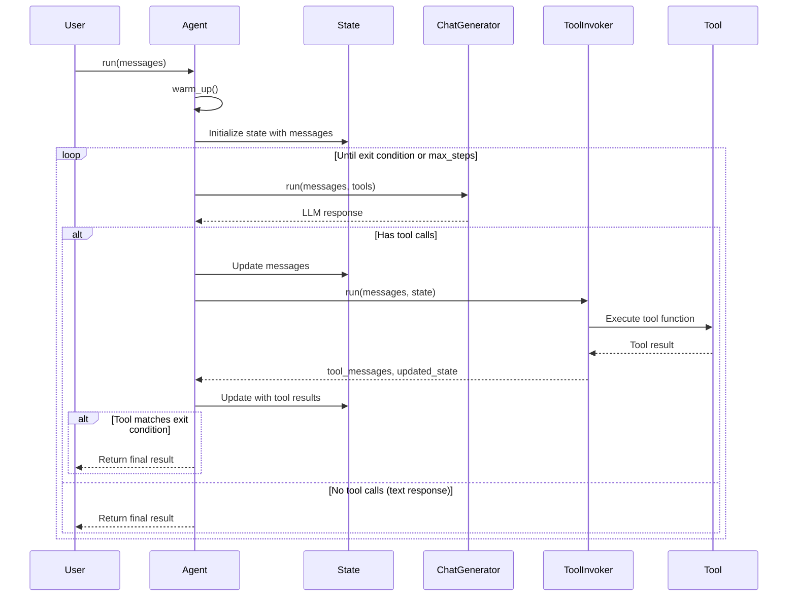
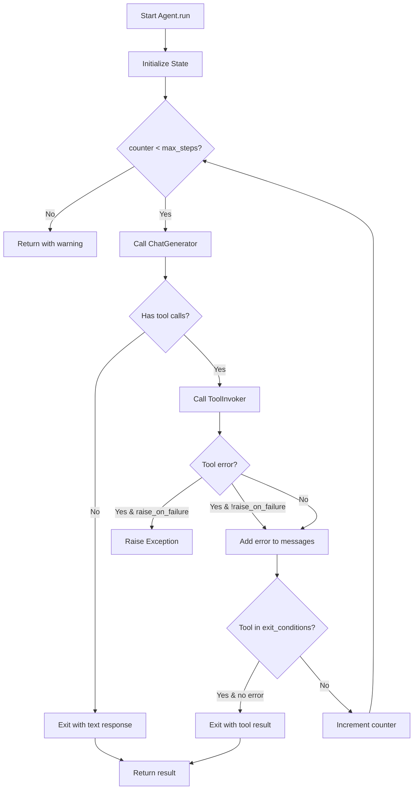

# Agent System - Phân Tích Chi Tiết

## Tổng quan

Agent System trong Haystack cho phép xây dựng AI agents có khả năng sử dụng tools để hoàn thành tasks. Agent hoạt động theo mô hình ReAct (Reason + Act) loop.

**Files:**
- `haystack/components/agents/agent.py` - Main Agent class
- `haystack/components/agents/state/state.py` - State management
- `haystack/components/tools/tool_invoker.py` - Tool execution

---

## Sequence Diagram - Agent Execution



---

## Class `Agent`

**Vị trí:** `haystack/components/agents/agent.py` Line 68-860

### Constructor

```python
def __init__(
    self,
    *,
    chat_generator: ChatGenerator,              # LLM với tool support
    tools: Optional[ToolsType] = None,          # Tools cho agent
    system_prompt: Optional[str] = None,        # System prompt
    exit_conditions: Optional[list[str]] = None,  # Điều kiện dừng
    state_schema: Optional[dict[str, Any]] = None,  # Schema cho state
    max_agent_steps: int = 100,                 # Max iterations
    streaming_callback: Optional[StreamingCallbackT] = None,
    raise_on_tool_invocation_failure: bool = False,
    tool_invoker_kwargs: Optional[dict[str, Any]] = None,
) -> None:
```

**Giải thích parameters:**
- `chat_generator`: LLM phải hỗ trợ `tools` parameter trong `run()`
- `tools`: List of Tool, Toolset, hoặc mix cả hai
- `exit_conditions`:
  - `["text"]`: Dừng khi LLM trả về text response (không tool call)
  - `["tool_name"]`: Dừng sau khi tool cụ thể được execute
- `state_schema`: Custom schema cho State object
- `max_agent_steps`: Ngăn infinite loops

### Validation

```python
# Line 183-188: Validate chat_generator supports tools
chat_generator_run_method = inspect.signature(chat_generator.run)
if "tools" not in chat_generator_run_method.parameters:
    raise TypeError(
        f"{type(chat_generator).__name__} does not accept tools parameter..."
    )

# Line 190-198: Validate exit_conditions
valid_exits = ["text"] + [tool.name for tool in flatten_tools_or_toolsets(tools)]
if not all(condition in valid_exits for condition in exit_conditions):
    raise ValueError(f"Invalid exit conditions: {exit_conditions}")
```

---

### `run` Method

**Vị trí:** Line 523-686

```python
def run(
    self,
    messages: list[ChatMessage],
    streaming_callback: Optional[StreamingCallbackT] = None,
    *,
    generation_kwargs: Optional[dict[str, Any]] = None,
    break_point: Optional[AgentBreakpoint] = None,
    snapshot: Optional[AgentSnapshot] = None,
    system_prompt: Optional[str] = None,
    tools: Optional[Union[ToolsType, list[str]]] = None,
    **kwargs: Any,
) -> dict[str, Any]:
```

**Main Execution Loop:**

```python
while exe_context.counter < self.max_agent_steps:
    # 1. Check breakpoint for chat_generator
    Agent._check_chat_generator_breakpoint(...)

    # 2. Skip if resuming from tool breakpoint
    if exe_context.skip_chat_generator:
        llm_messages = exe_context.state.get("messages", [])[-1:]
        exe_context.skip_chat_generator = False
    else:
        # 3. Call ChatGenerator
        result = Pipeline._run_component(
            component_name="chat_generator",
            component={"instance": self.chat_generator},
            inputs={
                "messages": exe_context.state.data["messages"],
                **exe_context.chat_generator_inputs,
            },
            ...
        )
        llm_messages = result["replies"]
        exe_context.state.set("messages", llm_messages)

    # 4. Check if should exit (no tool calls)
    if not any(msg.tool_call for msg in llm_messages) or self._tool_invoker is None:
        exe_context.counter += 1
        break

    # 5. Check breakpoint for tool_invoker
    Agent._check_tool_invoker_breakpoint(...)

    # 6. Execute tools
    tool_invoker_result = Pipeline._run_component(
        component_name="tool_invoker",
        component={"instance": self._tool_invoker},
        inputs={
            "messages": llm_messages,
            "state": exe_context.state,
            **exe_context.tool_invoker_inputs,
        },
        ...
    )
    tool_messages = tool_invoker_result["tool_messages"]
    exe_context.state = tool_invoker_result["state"]
    exe_context.state.set("messages", tool_messages)

    # 7. Check exit conditions based on tool names
    if self.exit_conditions != ["text"] and self._check_exit_conditions(...):
        exe_context.counter += 1
        break

    exe_context.counter += 1
```

---

## `_ExecutionContext` Dataclass

**Vị trí:** Line 46-66

```python
@dataclass
class _ExecutionContext:
    state: State                    # Current agent state
    component_visits: dict          # Track component visits
    chat_generator_inputs: dict     # Runtime inputs for LLM
    tool_invoker_inputs: dict       # Runtime inputs for tools
    counter: int = 0                # Step counter
    skip_chat_generator: bool = False  # Skip LLM on resume
```

**Mục đích:**
- Encapsulate all execution state
- Support resuming from breakpoints
- Track number of steps taken

---

## State Management

**File:** `haystack/components/agents/state/state.py`

```python
class State:
    def __init__(
        self,
        schema: dict[str, dict[str, Any]],
        data: Optional[dict[str, Any]] = None
    ):
        self.schema = schema
        self.data = {}

    def get(self, key: str, default: Any = None) -> Any:
        """Get value from state."""
        return self.data.get(key, default)

    def set(self, key: str, value: Any) -> None:
        """Set value in state, using handler if defined."""
        if key in self.schema:
            handler = self.schema[key].get("handler")
            if handler:
                # Use custom handler to merge values
                self.data[key] = handler(self.data.get(key), value)
                return
        self.data[key] = value
```

**Default State Schema:**

```python
# Messages use merge_lists handler
resolved_state_schema = {
    "messages": {
        "type": list[ChatMessage],
        "handler": merge_lists  # Append new messages to existing
    }
}
```

---

## Tool Selection

**Vị trí:** Line 364-400

```python
def _select_tools(self, tools: Optional[Union[ToolsType, list[str]]] = None) -> ToolsType:
    if tools is None:
        return self.tools

    # Select tools by name
    if isinstance(tools, list) and all(isinstance(t, str) for t in tools):
        available_tools = flatten_tools_or_toolsets(self.tools)
        valid_tool_names = {tool.name for tool in available_tools}
        return [tool for tool in available_tools if tool.name in tools]

    # Use provided Toolset
    if isinstance(tools, Toolset):
        return tools

    # Use provided Tool list
    return tools
```

**Use Cases:**
```python
# Use all configured tools
agent.run(messages=messages)

# Select specific tools by name
agent.run(messages=messages, tools=["search", "calculator"])

# Use different tools for this run
agent.run(messages=messages, tools=[new_tool])
```

---

## Exit Conditions

**Vị trí:** Line 831-859

```python
def _check_exit_conditions(
    self,
    llm_messages: list[ChatMessage],
    tool_messages: list[ChatMessage]
) -> bool:
    matched_exit_conditions = set()
    has_errors = False

    for msg in llm_messages:
        if msg.tool_call and msg.tool_call.tool_name in self.exit_conditions:
            matched_exit_conditions.add(msg.tool_call.tool_name)

            # Check for errors in the matching tool
            tool_errors = [
                tool_msg.tool_call_result.error
                for tool_msg in tool_messages
                if tool_msg.tool_call_result is not None
                and tool_msg.tool_call_result.origin.tool_name == msg.tool_call.tool_name
            ]
            if any(tool_errors):
                has_errors = True
                break

    return bool(matched_exit_conditions) and not has_errors
```

**Logic:**
1. Check nếu tool call name nằm trong exit_conditions
2. Verify không có errors từ tool đó
3. Return True chỉ khi matched AND no errors

---

## Flowchart - Agent Decision Flow



---

## Serialization

```python
def to_dict(self) -> dict[str, Any]:
    return default_to_dict(
        self,
        chat_generator=component_to_dict(self.chat_generator, "chat_generator"),
        tools=serialize_tools_or_toolset(self.tools),
        system_prompt=self.system_prompt,
        exit_conditions=self.exit_conditions,
        state_schema=_schema_to_dict(self._state_schema),
        max_agent_steps=self.max_agent_steps,
        streaming_callback=serialize_callable(self.streaming_callback),
        raise_on_tool_invocation_failure=self.raise_on_tool_invocation_failure,
        tool_invoker_kwargs=self.tool_invoker_kwargs,
    )

@classmethod
def from_dict(cls, data: dict[str, Any]) -> "Agent":
    init_params = data.get("init_parameters", {})
    deserialize_chatgenerator_inplace(init_params, key="chat_generator")
    deserialize_tools_or_toolset_inplace(init_params, key="tools")
    if init_params.get("state_schema"):
        init_params["state_schema"] = _schema_from_dict(init_params["state_schema"])
    return default_from_dict(cls, data)
```

---

## Ví Dụ Sử Dụng

### Basic Agent với Tools

```python
from haystack.components.agents import Agent
from haystack.components.generators.chat import OpenAIChatGenerator
from haystack.tools import Tool

def search(query: str) -> str:
    """Search for information."""
    return f"Results for: {query}"

def calculator(expression: str) -> float:
    """Calculate math expression."""
    return eval(expression)

tools = [
    Tool(
        name="search",
        description="Search the web",
        parameters={"type": "object", "properties": {...}},
        function=search
    ),
    Tool(
        name="calculator",
        description="Calculate math",
        parameters={"type": "object", "properties": {...}},
        function=calculator
    )
]

agent = Agent(
    chat_generator=OpenAIChatGenerator(model="gpt-4"),
    tools=tools,
    system_prompt="You are a helpful assistant.",
    exit_conditions=["text"]
)

result = agent.run(messages=[ChatMessage.from_user("What is 2+2?")])
```

### Agent với Custom Exit Condition

```python
# Agent dừng sau khi gọi tool "final_answer"
agent = Agent(
    chat_generator=OpenAIChatGenerator(),
    tools=[
        Tool(name="search", ...),
        Tool(name="final_answer", ...)
    ],
    exit_conditions=["final_answer"]  # Dừng sau khi gọi final_answer
)
```

### Agent với Custom State

```python
# Custom state để track history
agent = Agent(
    chat_generator=OpenAIChatGenerator(),
    tools=tools,
    state_schema={
        "search_history": {"type": list[str]},
        "context": {"type": dict}
    }
)

result = agent.run(
    messages=[...],
    search_history=["previous searches"],  # Pass initial state
    context={"user": "John"}
)
```

### Async Agent

```python
result = await agent.run_async(
    messages=[ChatMessage.from_user("Search for AI papers")],
    streaming_callback=async_callback
)
```

---

## Dependencies

### Imports

```python
from haystack.components.agents import Agent
from haystack.components.agents.state import State
from haystack.components.tools import ToolInvoker
from haystack.tools import Tool, Toolset
```

### Components sử dụng Agent

| Component | Usage |
|-----------|-------|
| Pipeline | Agent có thể là component trong pipeline |
| SuperComponent | Wrap agent như một component |
