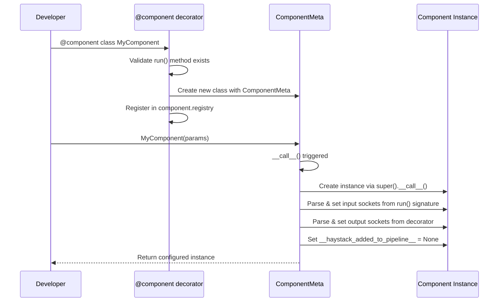
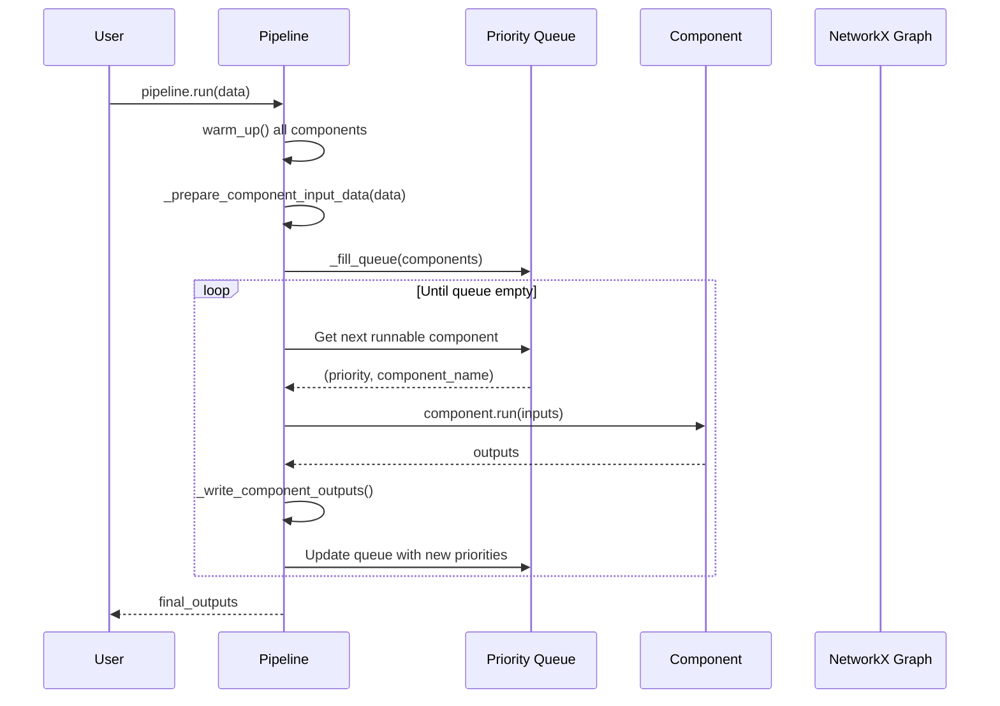

# Core Framework Layer

## Tổng quan

Core Framework là tầng nền tảng của Haystack, cung cấp các thành phần cốt lõi để xây dựng và chạy các pipeline. Layer này nằm trong thư mục `haystack/core/`.

## Cấu trúc thư mục

```
haystack/core/
├── __init__.py              # Export SuperComponent
├── errors.py                # Định nghĩa các exceptions
├── serialization.py         # Serialization/deserialization utilities
├── type_utils.py            # Type checking và compatibility
├── component/               # Hệ thống Component
│   ├── __init__.py
│   ├── component.py         # @component decorator và ComponentMeta
│   ├── sockets.py           # InputSocket, OutputSocket
│   └── types.py             # Type definitions
├── pipeline/                # Pipeline orchestration
│   ├── __init__.py
│   ├── base.py              # PipelineBase class
│   ├── pipeline.py          # Pipeline (sync)
│   ├── async_pipeline.py    # AsyncPipeline
│   ├── component_checks.py  # Component validation logic
│   ├── breakpoint.py        # Debugging breakpoints
│   ├── descriptions.py      # Pipeline input/output descriptions
│   ├── draw.py              # Mermaid diagram generation
│   ├── template.py          # Pipeline templates
│   └── utils.py             # Utility functions
└── super_component/         # SuperComponent (composite pattern)
    ├── __init__.py
    ├── super_component.py   # SuperComponent class
    └── utils.py             # Helper functions
```

## Core Components

### 1. Component System (`component/`)

File phân tích chi tiết: [component.md](./component.md)

**Mục đích:** Định nghĩa hệ thống component - đơn vị xử lý cơ bản trong Haystack.

**Components chính:**
| File | Class/Function | Mô tả |
|------|----------------|-------|
| `component.py` | `@component` | Decorator đánh dấu class là component |
| `component.py` | `ComponentMeta` | Metaclass xử lý khởi tạo component |
| `component.py` | `Component` | Protocol định nghĩa interface |
| `sockets.py` | `InputSocket` | Định nghĩa input socket |
| `sockets.py` | `OutputSocket` | Định nghĩa output socket |

### 2. Pipeline Orchestration (`pipeline/`)

File phân tích chi tiết: [pipeline.md](./pipeline.md)

**Mục đích:** Quản lý thực thi pipeline - kết nối và chạy các components theo đúng thứ tự.

**Components chính:**
| File | Class/Function | Mô tả |
|------|----------------|-------|
| `base.py` | `PipelineBase` | Base class cho tất cả pipelines |
| `pipeline.py` | `Pipeline` | Synchronous pipeline execution |
| `async_pipeline.py` | `AsyncPipeline` | Asynchronous pipeline execution |
| `component_checks.py` | `can_component_run()` | Kiểm tra component có thể chạy không |
| `template.py` | `PredefinedPipeline` | Templates cho các pipeline phổ biến |

### 3. SuperComponent (`super_component/`)

File phân tích chi tiết: [super_component.md](./super_component.md)

**Mục đích:** Cho phép wrap một pipeline thành một component đơn lẻ.

**Components chính:**
| File | Class/Function | Mô tả |
|------|----------------|-------|
| `super_component.py` | `SuperComponent` | Wrap pipeline thành component |
| `super_component.py` | `@super_component` | Decorator version |

---

## Luồng Khởi Tạo Component



---

## Luồng Thực Thi Pipeline



---

## Design Patterns Sử Dụng

### 1. Decorator Pattern
- `@component` decorator transform classes thành components
- Thêm metaclass, registry, và socket management

### 2. Protocol Pattern (Duck Typing)
- `Component` là runtime_checkable Protocol
- Chỉ cần có method `run()` là đủ

### 3. Composite Pattern
- `SuperComponent` wrap pipeline thành single component
- Cho phép nested pipelines

### 4. DAG Pattern
- Pipeline sử dụng `networkx.MultiDiGraph`
- Topological sorting cho execution order
- Hỗ trợ cycles với `max_runs_per_component`

### 5. Priority Queue Pattern
- Components được xếp hạng theo priority
- `HIGHEST` > `READY` > `DEFER` > `DEFER_LAST` > `BLOCKED`

---

## Mối Quan Hệ Giữa Các Module

```
┌─────────────────────────────────────────────────────────────┐
│                        Pipeline                              │
│  - Sử dụng networkx.MultiDiGraph                            │
│  - Gọi Component.run() theo priority queue                  │
└─────────────────────────┬───────────────────────────────────┘
                          │
                          │ uses
                          ▼
┌─────────────────────────────────────────────────────────────┐
│                       Component                              │
│  - @component decorator                                      │
│  - InputSocket/OutputSocket                                  │
│  - ComponentMeta metaclass                                   │
└─────────────────────────┬───────────────────────────────────┘
                          │
                          │ extends
                          ▼
┌─────────────────────────────────────────────────────────────┐
│                     SuperComponent                           │
│  - Wrap Pipeline as Component                                │
│  - Input/Output mapping                                      │
└─────────────────────────────────────────────────────────────┘
```

---

## Files Phân Tích Chi Tiết

- [component.md](./component.md) - Phân tích hệ thống Component
- [pipeline.md](./pipeline.md) - Phân tích Pipeline orchestration
- [super_component.md](./super_component.md) - Phân tích SuperComponent
