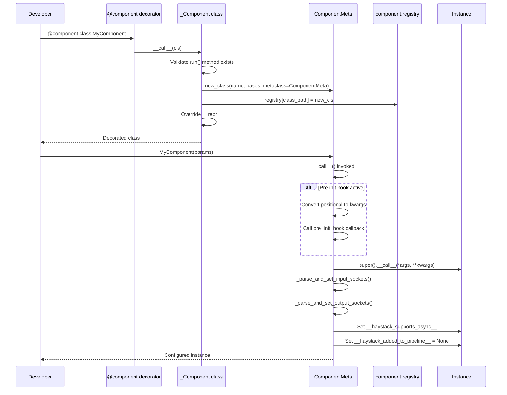
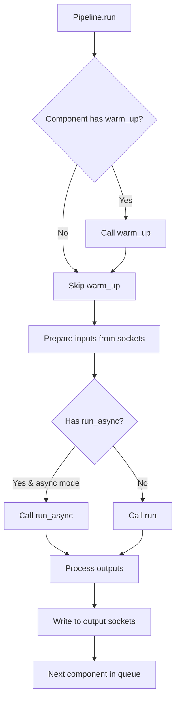

# Component System - Phân Tích Chi Tiết

## Tổng quan

Component System là trái tim của Haystack, định nghĩa cách các units xử lý được tạo và kết nối trong pipeline.

**File:** `haystack/core/component/component.py`

---

## Sequence Diagram - Khởi Tạo Component



---

## Các Class và Function Chính

### 1. `@component` Decorator

**Vị trí:** Line 630

```python
component = _Component()
```

`component` là một instance singleton của `_Component` class, được sử dụng như decorator.

---

### 2. `_Component` Class

**Vị trí:** Line 392-627

**Mục đích:** Class quản lý việc đăng ký và cấu hình components.

#### 2.1 `__init__`

```python
def __init__(self):
    self.registry = {}  # Lưu trữ tất cả registered components
```

`registry` là dictionary lưu trữ mapping từ class path đến class object.

#### 2.2 `__call__`

**Vị trí:** Line 609-627

```python
def __call__(self, cls: Optional[type[T]] = None) -> Union[type[T], Callable[[type[T]], type[T]]]:
    def wrap(cls: type[T]) -> type[T]:
        return self._component(cls)

    if cls:
        # @component (không có ngoặc)
        return wrap(cls)

    # @component() (có ngoặc)
    return wrap
```

**Giải thích:**
- Hỗ trợ cả hai cách sử dụng: `@component` và `@component()`
- Nếu `cls` được truyền trực tiếp → gọi ngay `_component(cls)`
- Nếu không → trả về wrapper function

#### 2.3 `_component` Method

**Vị trí:** Line 558-606

```python
def _component(self, cls: type[T]) -> type[T]:
    # 1. Validate run() method
    if not hasattr(cls, "run"):
        raise ComponentError(f"{cls.__name__} must have a 'run()' method.")

    # 2. Create new class with ComponentMeta
    new_cls = new_class(
        cls.__name__,
        cls.__bases__,
        {"metaclass": ComponentMeta},
        copy_class_namespace
    )

    # 3. Register component
    class_path = f"{new_cls.__module__}.{new_cls.__name__}"
    self.registry[class_path] = new_cls

    # 4. Override __repr__
    new_cls.__repr__ = _component_repr

    return new_cls
```

**Giải thích:**
1. **Validate:** Kiểm tra class có method `run()` không
2. **Create new class:** Tạo class mới kế thừa từ class gốc nhưng sử dụng `ComponentMeta` làm metaclass
3. **Register:** Lưu vào registry với key là fully qualified class name
4. **Override __repr__:** Thay thế `__repr__` để hiển thị input/output sockets

#### 2.4 `set_input_types` và `set_output_types`

**Vị trí:** Line 435-518

```python
def set_input_types(self, instance, **types):
    """Đặt input types khi run() sử dụng **kwargs."""
    instance.__haystack_input__ = Sockets(
        instance,
        {name: InputSocket(name=name, type=type_) for name, type_ in types.items()},
        InputSocket
    )

def set_output_types(self, instance, **types):
    """Đặt output types động trong __init__."""
    instance.__haystack_output__ = Sockets(
        instance,
        {name: OutputSocket(name=name, type=type_) for name, type_ in types.items()},
        OutputSocket
    )
```

**Use case:**
```python
@component
class DynamicComponent:
    def __init__(self, output_names: list[str]):
        # Dynamic output types
        component.set_output_types(
            self,
            **{name: str for name in output_names}
        )

    def run(self, **kwargs):
        ...
```

#### 2.5 `output_types` Decorator

**Vị trí:** Line 520-556

```python
def output_types(self, **types: Any) -> Callable:
    """Decorator factory để specify output types."""

    def output_types_decorator(run_method):
        if run_method.__name__ not in ("run", "run_async"):
            raise ComponentError("...")

        setattr(
            run_method,
            "_output_types_cache",
            {name: OutputSocket(name=name, type=type_) for name, type_ in types.items()}
        )
        return run_method

    return output_types_decorator
```

**Giải thích:**
- Tạo decorator để đánh dấu output types cho method `run()` hoặc `run_async()`
- Lưu thông tin vào attribute `_output_types_cache` của method
- Sẽ được xử lý bởi `ComponentMeta` khi khởi tạo instance

---

### 3. `ComponentMeta` Metaclass

**Vị trí:** Line 184-315

**Mục đích:** Metaclass xử lý khởi tạo component instances.

#### 3.1 `__call__`

**Vị trí:** Line 279-315

```python
def __call__(cls, *args, **kwargs):
    """Called khi instantiate Component, trước __new__ và __init__."""

    # Handle pre-init hook
    pre_init_hook = _COMPONENT_PRE_INIT_HOOK.get()
    if pre_init_hook is None or pre_init_hook.in_progress:
        instance = super().__call__(*args, **kwargs)
    else:
        # Convert positional args to kwargs
        named_positional_args = ComponentMeta._positional_to_kwargs(cls, args)
        kwargs.update(named_positional_args)
        pre_init_hook.callback(cls, kwargs)
        instance = super().__call__(**kwargs)

    # Setup I/O sockets
    has_async_run = hasattr(instance, "run_async")
    instance.__haystack_supports_async__ = has_async_run

    ComponentMeta._parse_and_set_input_sockets(cls, instance)
    ComponentMeta._parse_and_set_output_sockets(instance)

    instance.__haystack_added_to_pipeline__ = None

    return instance
```

**Giải thích:**
1. **Pre-init hook:** Cho phép modify init parameters trước khi instance được tạo
2. **Create instance:** Gọi `super().__call__()` để tạo instance
3. **Setup sockets:** Parse signatures và set up input/output sockets
4. **Track pipeline:** Set flag để track component đã được add vào pipeline chưa

#### 3.2 `_parse_and_set_input_sockets`

**Vị trí:** Line 228-277

```python
@staticmethod
def _parse_and_set_input_sockets(component_cls: type, instance: Any) -> None:
    def inner(method, sockets):
        run_signature = inspect.signature(method)

        for param_name, param_info in run_signature.parameters.items():
            if param_name == "self":
                continue
            if param_info.kind in (Parameter.VAR_POSITIONAL, Parameter.VAR_KEYWORD):
                continue

            socket_kwargs = {
                "name": param_name,
                "type": param_info.annotation
            }
            if param_info.default != Parameter.empty:
                socket_kwargs["default_value"] = param_info.default

            new_socket = InputSocket(**socket_kwargs)
            sockets[param_name] = new_socket

    if not hasattr(instance, "__haystack_input__"):
        instance.__haystack_input__ = Sockets(instance, {}, InputSocket)

    inner(getattr(component_cls, "run"), instance.__haystack_input__)
```

**Giải thích:**
- Parse signature của method `run()` để extract input parameters
- Tạo `InputSocket` cho mỗi parameter (trừ `self`, `*args`, `**kwargs`)
- Nếu parameter có default value → socket không mandatory

#### 3.3 `_parse_and_set_output_sockets`

**Vị trí:** Line 204-226

```python
@staticmethod
def _parse_and_set_output_sockets(instance: Any) -> None:
    # Nếu đã set bởi set_output_types() → skip
    if not hasattr(instance, "__haystack_output__"):
        # Lấy từ decorator cache
        run_output_types = getattr(instance.run, "_output_types_cache", {})
        instance.__haystack_output__ = Sockets(
            instance,
            deepcopy(run_output_types),
            OutputSocket
        )
```

**Giải thích:**
- Ưu tiên sử dụng output types từ `set_output_types()` nếu đã gọi trong `__init__`
- Nếu không, lấy từ `_output_types_cache` (từ `@component.output_types` decorator)

---

### 4. `Component` Protocol

**Vị trí:** Line 133-181

```python
@runtime_checkable
class Component(Protocol):
    """Protocol định nghĩa interface cho components."""

    def run(self, *args: Any, **kwargs: Any) -> Mapping[str, Any]:
        ...
```

**Giải thích:**
- `Protocol` cho phép duck typing với type checking
- `@runtime_checkable` cho phép sử dụng `isinstance()` at runtime
- Chỉ yêu cầu method `run()` → flexible interface

---

## Flowchart - Component Execution



---

## Dependencies

### Imports từ module này

```python
from haystack.core.component import (
    Component,        # Protocol
    component,        # Decorator instance
    InputSocket,      # From sockets.py
    OutputSocket,     # From sockets.py
)
```

### Modules sử dụng Component

| Module | Usage |
|--------|-------|
| `haystack/core/pipeline/base.py` | Orchestrate component execution |
| `haystack/core/super_component/` | Wrap pipeline as component |
| `haystack/components/*` | All components use @component decorator |
| `haystack/tools/component_tool.py` | Wrap component as tool |

---

## Ví Dụ Sử Dụng

### Basic Component

```python
from haystack import component

@component
class TextCleaner:
    def __init__(self, lowercase: bool = True):
        self.lowercase = lowercase

    @component.output_types(cleaned_text=str)
    def run(self, text: str) -> dict[str, str]:
        if self.lowercase:
            text = text.lower()
        return {"cleaned_text": text.strip()}
```

### Component với Dynamic Inputs

```python
@component
class MultiInputComponent:
    def __init__(self, input_names: list[str]):
        # Dynamic input types
        component.set_input_types(
            self,
            **{name: str for name in input_names}
        )

    @component.output_types(result=str)
    def run(self, **kwargs) -> dict[str, str]:
        combined = " ".join(kwargs.values())
        return {"result": combined}
```

### Component với Async Support

```python
@component
class AsyncGenerator:
    @component.output_types(response=str)
    def run(self, prompt: str) -> dict[str, str]:
        # Sync version
        return {"response": self._generate(prompt)}

    @component.output_types(response=str)
    async def run_async(self, prompt: str) -> dict[str, str]:
        # Async version
        response = await self._generate_async(prompt)
        return {"response": response}
```
