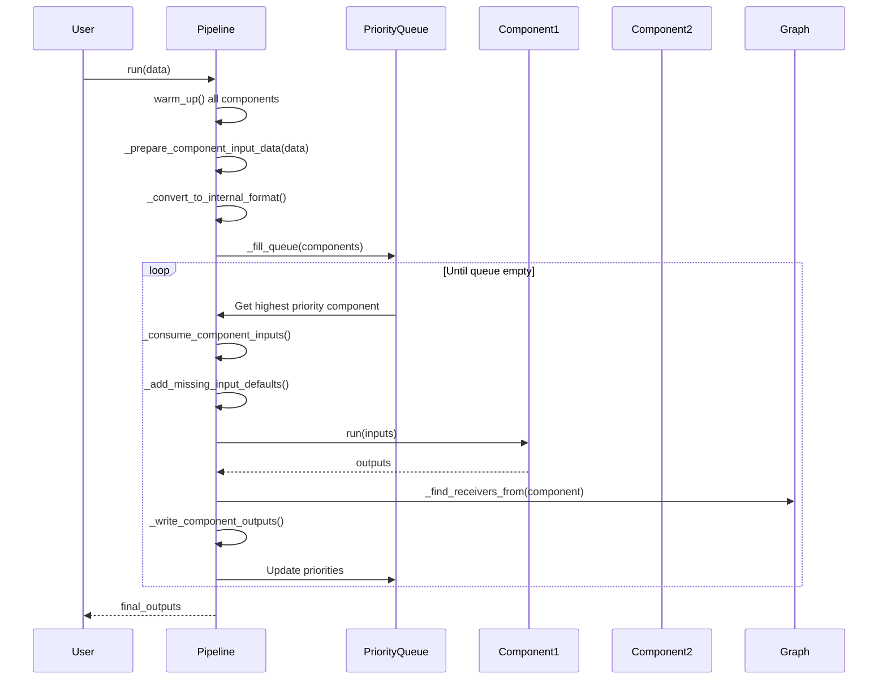
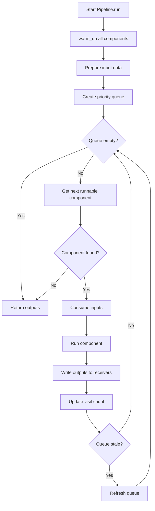

# Pipeline System - Phân Tích Chi Tiết

## Tổng quan

Pipeline System là engine orchestration của Haystack, quản lý việc thực thi các components theo đúng thứ tự dựa trên graph dependencies.

**Files:**
- `haystack/core/pipeline/base.py` - PipelineBase class
- `haystack/core/pipeline/pipeline.py` - Pipeline (sync)
- `haystack/core/pipeline/async_pipeline.py` - AsyncPipeline

---

## Sequence Diagram - Pipeline Execution



---

## Các Class Chính

### 1. `PipelineBase` Class

**Vị trí:** `base.py` Line 70-1478

**Mục đích:** Base class chứa tất cả logic orchestration.

#### 1.1 Constructor

```python
def __init__(
    self,
    metadata: Optional[dict[str, Any]] = None,
    max_runs_per_component: int = 100,
    connection_type_validation: bool = True,
):
    self._telemetry_runs = 0
    self._last_telemetry_sent: Optional[datetime] = None
    self.metadata = metadata or {}
    self.graph = networkx.MultiDiGraph()  # DAG cho component connections
    self._max_runs_per_component = max_runs_per_component
    self._connection_type_validation = connection_type_validation
```

**Giải thích:**
- `graph`: NetworkX MultiDiGraph để lưu trữ components và connections
- `max_runs_per_component`: Giới hạn số lần chạy mỗi component (tránh infinite loops)
- `connection_type_validation`: Validate types khi connect

---

#### 1.2 `add_component` Method

**Vị trí:** Line 322-376

```python
def add_component(self, name: str, instance: Component) -> None:
    # 1. Validate unique name
    if name in self.graph.nodes:
        raise ValueError(f"A component named '{name}' already exists")

    # 2. Validate reserved names
    if name == "_debug":
        raise ValueError("'_debug' is a reserved name")

    # 3. Validate no dots in name
    if "." in name:
        raise ValueError("Cannot contain '.' characters")

    # 4. Validate is component
    if not isinstance(instance, Component):
        raise PipelineValidationError("Not a component")

    # 5. Check not already in another pipeline
    if getattr(instance, "__haystack_added_to_pipeline__", None):
        raise PipelineError("Component already in another Pipeline")

    # 6. Add to graph
    setattr(instance, "__haystack_added_to_pipeline__", self)
    setattr(instance, "__component_name__", name)

    self.graph.add_node(
        name,
        instance=instance,
        input_sockets=instance.__haystack_input__._sockets_dict,
        output_sockets=instance.__haystack_output__._sockets_dict,
        visits=0,
    )
```

**Giải thích:**
- Validate component trước khi add
- Mỗi component chỉ có thể thuộc một pipeline
- Store component với input/output sockets metadata

---

#### 1.3 `connect` Method

**Vị trí:** Line 420-601

```python
def connect(self, sender: str, receiver: str) -> "PipelineBase":
    # 1. Parse connection strings
    sender_component_name, sender_socket_name = parse_connect_string(sender)
    receiver_component_name, receiver_socket_name = parse_connect_string(receiver)

    # 2. Validate components exist
    sender_sockets = self.graph.nodes[sender_component_name]["output_sockets"]
    receiver_sockets = self.graph.nodes[receiver_component_name]["input_sockets"]

    # 3. Find matching sockets
    possible_connections = []
    for sender_sock, receiver_sock in itertools.product(
        sender_socket_candidates, receiver_socket_candidates
    ):
        if _types_are_compatible(sender_sock.type, receiver_sock.type):
            possible_connections.append((sender_sock, receiver_sock))

    # 4. Handle multiple possible connections
    if len(possible_connections) > 1:
        # Try to match by name
        name_matches = [
            (out_sock, in_sock)
            for out_sock, in_sock in possible_connections
            if in_sock.name == out_sock.name
        ]
        ...

    # 5. Create edge in graph
    self.graph.add_edge(
        sender_component_name,
        receiver_component_name,
        key=f"{sender_socket.name}/{receiver_socket.name}",
        conn_type=_type_name(sender_socket.type),
        from_socket=sender_socket,
        to_socket=receiver_socket,
        mandatory=receiver_socket.is_mandatory,
    )
```

**Giải thích:**
1. Parse connection strings (e.g., "retriever.documents")
2. Validate cả sender và receiver components tồn tại
3. Tìm socket pairs có compatible types
4. Nếu có nhiều possible connections → match by name
5. Create edge trong graph với metadata

**Connection Formats:**
```python
# Explicit sockets
pipeline.connect("embedder.embedding", "retriever.query_embedding")

# Auto-match by name (nếu unique)
pipeline.connect("embedder", "retriever")
```

---

#### 1.4 Priority Queue và Component Execution

**ComponentPriority Enum:**

```python
class ComponentPriority(IntEnum):
    HIGHEST = 1    # Greedy socket ready + all sockets ready
    READY = 2      # All predecessors executed
    DEFER = 3      # Lazy variadic sockets resolved
    DEFER_LAST = 4 # Can run but should wait
    BLOCKED = 5    # Cannot run yet
```

**`_calculate_priority` Method:**

```python
@staticmethod
def _calculate_priority(component: dict, inputs: dict) -> ComponentPriority:
    if not can_component_run(component, inputs):
        return ComponentPriority.BLOCKED
    elif is_any_greedy_socket_ready(component, inputs) and are_all_sockets_ready(component, inputs):
        return ComponentPriority.HIGHEST
    elif all_predecessors_executed(component, inputs):
        return ComponentPriority.READY
    elif are_all_lazy_variadic_sockets_resolved(component, inputs):
        return ComponentPriority.DEFER
    else:
        return ComponentPriority.DEFER_LAST
```

**Giải thích:**
- `BLOCKED`: Component không thể chạy (missing required inputs)
- `HIGHEST`: Có greedy input sẵn sàng và tất cả inputs ready
- `READY`: Tất cả predecessors đã execute
- `DEFER`/`DEFER_LAST`: Có thể chạy nhưng nên đợi

---

#### 1.5 `_consume_component_inputs` Method

**Vị trí:** Line 1028-1076

```python
@staticmethod
def _consume_component_inputs(
    component_name: str,
    component: dict,
    inputs: dict,
    is_resume: bool = False
) -> dict[str, Any]:
    component_inputs = inputs.get(component_name, {})
    consumed_inputs = {}
    greedy_inputs_to_remove = set()

    for socket_name, socket in component["input_sockets"].items():
        socket_inputs = component_inputs.get(socket_name, [])
        socket_inputs = [
            sock["value"] for sock in socket_inputs
            if sock["value"] is not _NO_OUTPUT_PRODUCED
        ]

        if socket_inputs:
            if not socket.is_variadic:
                # Non-variadic: take first input
                consumed_inputs[socket_name] = socket_inputs[0]
            elif socket.is_greedy:
                # Greedy variadic: take first, mark for removal
                greedy_inputs_to_remove.add(socket_name)
                consumed_inputs[socket_name] = [socket_inputs[0]]
            elif is_socket_lazy_variadic(socket):
                # Lazy variadic: take all inputs
                consumed_inputs[socket_name] = socket_inputs

    # Remove consumed inputs from global state
    ...
    return consumed_inputs
```

**Giải thích:**
- **Non-variadic socket:** Chỉ nhận một input
- **Greedy variadic:** Nhận input ngay khi có, xử lý từng cái một
- **Lazy variadic:** Đợi tất cả inputs trước khi xử lý

---

#### 1.6 `_write_component_outputs` Method

**Vị trí:** Line 1224-1281

```python
@staticmethod
def _write_component_outputs(
    component_name: str,
    component_outputs: Mapping[str, Any],
    inputs: dict[str, Any],
    receivers: list[tuple],
    include_outputs_from: set[str],
) -> Mapping[str, Any]:
    for receiver_name, sender_socket, receiver_socket in receivers:
        value = component_outputs.get(sender_socket.name, _NO_OUTPUT_PRODUCED)

        if is_socket_lazy_variadic(receiver_socket):
            # Append to lazy variadic socket
            _write_to_lazy_variadic_socket(
                inputs, receiver_name, receiver_socket.name,
                component_name, value
            )
        else:
            # Overwrite standard socket
            _write_to_standard_socket(
                inputs, receiver_name, receiver_socket.name,
                component_name, value
            )

    # Prune consumed outputs
    consumed_outputs = {sender_socket.name for _, sender_socket, __ in receivers}
    pruned_outputs = {
        key: value for key, value in component_outputs.items()
        if key not in consumed_outputs
    }
    return pruned_outputs
```

**Giải thích:**
- Distribute outputs đến các receiver components
- Lazy variadic sockets: append inputs
- Standard sockets: overwrite
- Prune outputs đã được consumed

---

### 2. `Pipeline` Class (Sync)

**Vị trí:** `pipeline.py`

```python
class Pipeline(PipelineBase):
    def run(
        self,
        data: dict[str, Any],
        include_outputs_from: Optional[set[str]] = None,
        debug: bool = False,
    ) -> dict[str, Any]:
        # 1. Warm up
        self.warm_up()

        # 2. Prepare inputs
        data = self._prepare_component_input_data(data)
        self.validate_input(data)
        inputs = self._convert_to_internal_format(data)

        # 3. Initialize outputs and queue
        pipeline_outputs: dict[str, dict[str, Any]] = {}
        component_visits: dict[str, int] = defaultdict(int)

        # 4. Fill priority queue
        priority_queue = self._fill_queue(
            list(self.graph.nodes),
            inputs,
            component_visits
        )

        # 5. Main execution loop
        while len(priority_queue) > 0:
            # Get next component
            result = self._get_next_runnable_component(
                priority_queue, component_visits
            )
            if result is None:
                break

            priority, component_name, component = result

            # Consume inputs
            component_inputs = self._consume_component_inputs(
                component_name, component, inputs
            )

            # Run component
            with self._create_component_span(...):
                component_outputs = component["instance"].run(**component_inputs)

            # Write outputs
            receivers = self._find_receivers_from(component_name)
            component_outputs = self._write_component_outputs(...)

            # Update visits
            component_visits[component_name] += 1

            # Refresh queue if stale
            if self._is_queue_stale(priority_queue):
                priority_queue = self._fill_queue(...)

        return pipeline_outputs
```

---

### 3. `AsyncPipeline` Class

**Vị trí:** `async_pipeline.py`

```python
class AsyncPipeline(PipelineBase):
    async def run_async(
        self,
        data: dict[str, Any],
        include_outputs_from: Optional[set[str]] = None,
    ) -> dict[str, Any]:
        # Similar to Pipeline.run() but uses:
        # - await component.run_async() for async components
        # - component.run() for sync components
        ...
```

---

## Flowchart - Pipeline Execution Loop



---

## Serialization

### `to_dict` Method

```python
def to_dict(self) -> dict[str, Any]:
    components = {}
    for name, instance in self.graph.nodes(data="instance"):
        components[name] = component_to_dict(instance, name)

    connections = []
    for sender, receiver, edge_data in self.graph.edges.data():
        connections.append({
            "sender": f"{sender}.{edge_data['from_socket'].name}",
            "receiver": f"{receiver}.{edge_data['to_socket'].name}"
        })

    return {
        "metadata": self.metadata,
        "max_runs_per_component": self._max_runs_per_component,
        "components": components,
        "connections": connections,
    }
```

### `from_dict` Class Method

```python
@classmethod
def from_dict(cls, data: dict[str, Any], callbacks=None) -> T:
    pipe = cls(
        metadata=data.get("metadata", {}),
        max_runs_per_component=data.get("max_runs_per_component", 100),
    )

    for name, component_data in data.get("components", {}).items():
        # Deserialize component
        instance = component_from_dict(component_class, component_data, ...)
        pipe.add_component(name=name, instance=instance)

    for connection in data.get("connections", []):
        pipe.connect(sender=connection["sender"], receiver=connection["receiver"])

    return pipe
```

---

## Ví Dụ Sử Dụng

### Basic RAG Pipeline

```python
from haystack import Pipeline
from haystack.components.embedders import SentenceTransformersTextEmbedder
from haystack.components.retrievers import InMemoryEmbeddingRetriever
from haystack.components.builders import PromptBuilder
from haystack.components.generators import OpenAIGenerator

# Create pipeline
pipeline = Pipeline()

# Add components
pipeline.add_component("embedder", SentenceTransformersTextEmbedder())
pipeline.add_component("retriever", InMemoryEmbeddingRetriever(document_store))
pipeline.add_component("prompt_builder", PromptBuilder(template="..."))
pipeline.add_component("llm", OpenAIGenerator())

# Connect components
pipeline.connect("embedder.embedding", "retriever.query_embedding")
pipeline.connect("retriever.documents", "prompt_builder.documents")
pipeline.connect("prompt_builder.prompt", "llm.prompt")

# Run
result = pipeline.run({"embedder": {"text": "What is Haystack?"}})
```

### Pipeline với Loops

```python
# Self-correcting pipeline
pipeline = Pipeline(max_runs_per_component=5)

pipeline.add_component("generator", OpenAIGenerator())
pipeline.add_component("validator", OutputValidator())
pipeline.add_component("router", ConditionalRouter(...))

pipeline.connect("generator", "validator")
pipeline.connect("validator", "router")
pipeline.connect("router.invalid", "generator")  # Loop back
pipeline.connect("router.valid", "output")
```
