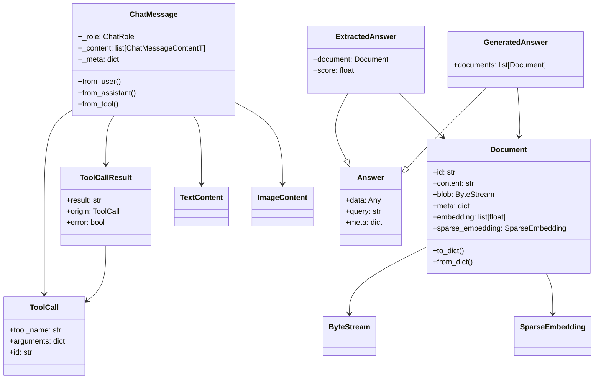
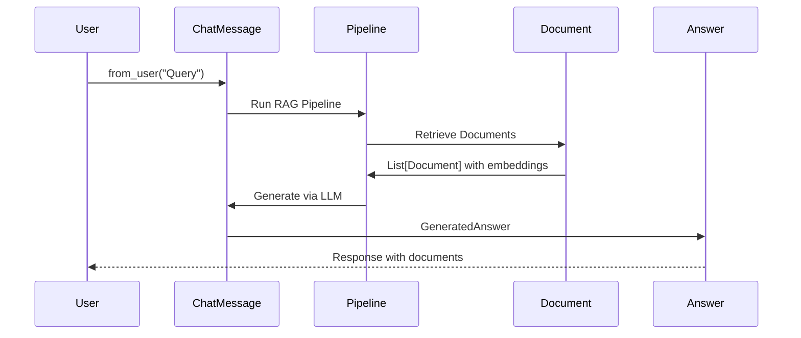

# Data Types Layer

## Tổng quan

Data Types Layer định nghĩa các kiểu dữ liệu cơ bản được sử dụng xuyên suốt Haystack framework. Layer này nằm trong thư mục `haystack/dataclasses/`.

## Cấu trúc thư mục

```
haystack/dataclasses/
├── __init__.py              # Lazy imports cho tất cả data types
├── document.py              # Document class - đơn vị dữ liệu cơ bản
├── chat_message.py          # ChatMessage, ChatRole, ToolCall, etc.
├── answer.py                # Answer, ExtractedAnswer, GeneratedAnswer
├── byte_stream.py           # ByteStream - xử lý binary data
├── sparse_embedding.py      # SparseEmbedding - sparse vectors
├── image_content.py         # ImageContent - nội dung hình ảnh
├── streaming_chunk.py       # StreamingChunk - streaming callbacks
└── state.py                 # State - agent state management
```

## Core Components

### 1. Document (`document.py`)

File phân tích chi tiết: [document.md](./document.md)

**Mục đích:** Đơn vị dữ liệu cơ bản trong Haystack, chứa content, metadata, embeddings.

```python
@dataclass
class Document(metaclass=_BackwardCompatible):
    id: str = field(default="")                           # Auto-generated nếu không set
    content: Optional[str] = field(default=None)          # Text content
    blob: Optional[ByteStream] = field(default=None)      # Binary data
    meta: dict[str, Any] = field(default_factory=dict)    # Metadata
    score: Optional[float] = field(default=None)          # Retrieval score
    embedding: Optional[list[float]] = field(default=None)         # Dense embedding
    sparse_embedding: Optional[SparseEmbedding] = field(default=None)  # Sparse embedding
```

**Key Features:**
- ID tự động sinh bằng SHA256 hash của content
- Hỗ trợ backward compatibility với Haystack 1.x
- Serialization với `to_dict()` / `from_dict()`
- Flatten metadata cho compatibility

---

### 2. ChatMessage (`chat_message.py`)

File phân tích chi tiết: [chat_message.md](./chat_message.md)

**Mục đích:** Đại diện cho một message trong LLM chat conversation.

```python
class ChatRole(str, Enum):
    USER = "user"          # Message từ user
    SYSTEM = "system"      # System prompt
    ASSISTANT = "assistant"  # Response từ LLM
    TOOL = "tool"          # Kết quả từ tool

@dataclass
class ChatMessage:
    _role: ChatRole
    _content: Sequence[ChatMessageContentT]  # List of content parts
    _name: Optional[str] = None
    _meta: dict[str, Any] = field(default_factory=dict)
```

**Content Types:**
| Class | Mô tả |
|-------|-------|
| `TextContent` | Text content của message |
| `ToolCall` | Tool call từ LLM |
| `ToolCallResult` | Kết quả của tool invocation |
| `ImageContent` | Image content (base64) |
| `ReasoningContent` | Reasoning từ models như o1 |

**Factory Methods:**
```python
ChatMessage.from_user(text="Hello")
ChatMessage.from_system(text="You are helpful")
ChatMessage.from_assistant(text="Hi!", tool_calls=[...])
ChatMessage.from_tool(tool_result="...", origin=tool_call)
```

---

### 3. ToolCall & ToolCallResult

**Mục đích:** Đại diện cho tool calls và results trong agent systems.

```python
@dataclass
class ToolCall:
    tool_name: str              # Tên tool được gọi
    arguments: dict[str, Any]   # Arguments cho tool
    id: Optional[str] = None    # ID của tool call
    extra: Optional[dict[str, Any]] = None  # Provider-specific info

@dataclass
class ToolCallResult:
    result: str                 # Kết quả của tool
    origin: ToolCall           # Tool call gốc
    error: bool                 # Có error không
```

---

### 4. Answer Types (`answer.py`)

**Mục đích:** Đại diện cho các loại câu trả lời từ hệ thống.

```python
@dataclass
class Answer:
    data: Any                   # Dữ liệu câu trả lời
    query: str                  # Query gốc
    meta: dict[str, Any]        # Metadata

@dataclass
class ExtractedAnswer(Answer):
    # Câu trả lời được trích xuất từ documents
    document: Optional[Document]
    score: Optional[float]

@dataclass
class GeneratedAnswer(Answer):
    # Câu trả lời được sinh bởi LLM
    documents: list[Document]
```

---

### 5. ByteStream (`byte_stream.py`)

**Mục đích:** Xử lý binary data trong pipeline.

```python
@dataclass
class ByteStream:
    data: bytes                 # Binary data
    mime_type: Optional[str]    # MIME type (image/jpeg, etc.)
    meta: dict[str, Any]        # Metadata

    @classmethod
    def from_file_path(cls, file_path: Path) -> "ByteStream": ...

    @classmethod
    def from_string(cls, text: str, encoding: str = "utf-8") -> "ByteStream": ...

    def to_file(self, destination_path: Path) -> None: ...
```

---

### 6. SparseEmbedding (`sparse_embedding.py`)

**Mục đích:** Sparse vector representation cho retrieval (BM25, SPLADE, etc.)

```python
@dataclass
class SparseEmbedding:
    indices: list[int]          # Indices của non-zero elements
    values: list[float]         # Values tại các indices
```

---

### 7. StreamingChunk (`streaming_chunk.py`)

**Mục đích:** Hỗ trợ streaming responses từ LLMs.

```python
@dataclass
class StreamingChunk:
    content: str                        # Chunk content
    meta: dict[str, Any]               # Metadata
    finish_reason: Optional[FinishReason]  # Lý do kết thúc
    component_info: Optional[ComponentInfo]  # Component info

class FinishReason(str, Enum):
    STOP = "stop"
    LENGTH = "length"
    TOOL_CALL = "tool_call"
    CONTENT_FILTER = "content_filter"

# Callback types
StreamingCallbackT = Union[SyncStreamingCallbackT, AsyncStreamingCallbackT]
SyncStreamingCallbackT = Callable[[StreamingChunk], None]
AsyncStreamingCallbackT = Callable[[StreamingChunk], Coroutine[Any, Any, None]]
```

---

## Design Patterns Sử Dụng

### 1. Dataclass Pattern
- Tất cả data types đều sử dụng Python `@dataclass`
- Automatic `__init__`, `__repr__`, `__eq__`
- Immutable by design

### 2. Factory Method Pattern
- `ChatMessage.from_user()`, `from_assistant()`, etc.
- `Document.from_dict()`, `ByteStream.from_file_path()`

### 3. Lazy Import Pattern
```python
# __init__.py sử dụng LazyImporter
sys.modules[__name__] = LazyImporter(
    name=__name__,
    module_file=__file__,
    import_structure=_import_structure
)
```
- Giảm startup time
- Chỉ load khi được sử dụng

### 4. Backward Compatibility Pattern
```python
class _BackwardCompatible(type):
    def __call__(cls, *args, **kwargs):
        # Convert NumPy arrays to lists
        if isinstance(embedding := kwargs.get("embedding"), ndarray):
            kwargs["embedding"] = embedding.tolist()
        # Remove legacy fields
        for field_name in LEGACY_FIELDS:
            kwargs.pop(field_name, None)
        return super().__call__(*args, **kwargs)
```

---

## Mối Quan Hệ Giữa Data Types



---

## Luồng Dữ Liệu



---

## Files Phân Tích Chi Tiết

- [document.md](./document.md) - Phân tích Document class
- [chat_message.md](./chat_message.md) - Phân tích ChatMessage class
- [streaming.md](./streaming.md) - Phân tích Streaming functionality
