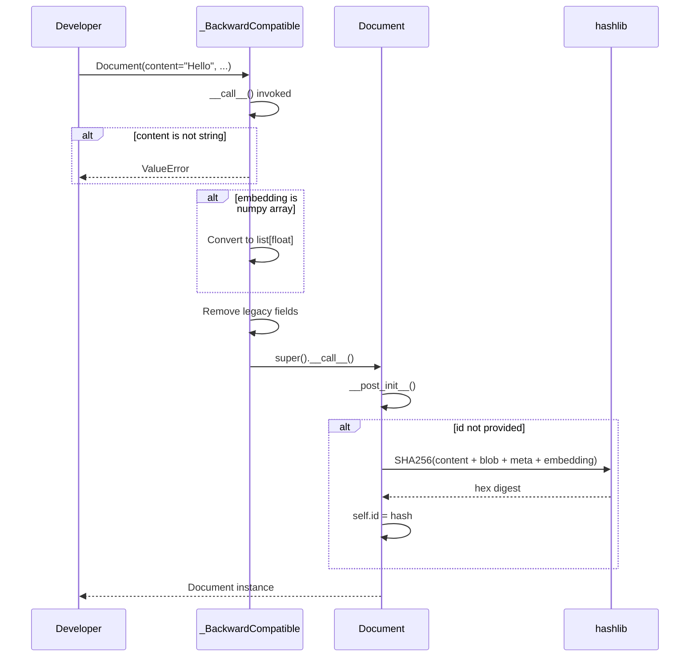
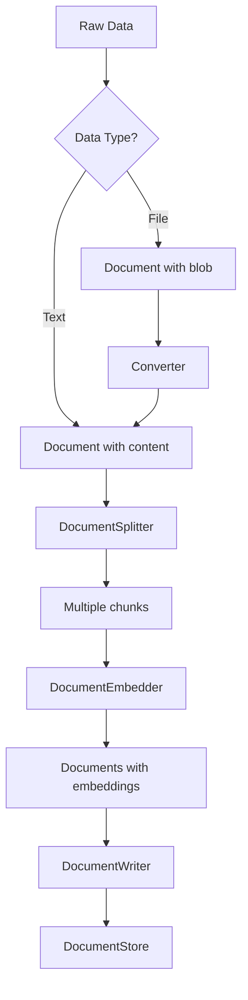

# Document Class - Phân Tích Chi Tiết

## Tổng quan

`Document` là đơn vị dữ liệu cơ bản trong Haystack, chứa content, metadata, và embeddings.

**File:** `haystack/dataclasses/document.py`

---

## Class Definition

```python
@dataclass
class Document(metaclass=_BackwardCompatible):
    """
    Base data class containing data to be queried.

    :param id: Unique identifier. Auto-generated if not set.
    :param content: Text content.
    :param blob: Binary data (images, PDFs, etc.)
    :param meta: Custom metadata (JSON-serializable).
    :param score: Retrieval score.
    :param embedding: Dense vector representation.
    :param sparse_embedding: Sparse vector for BM25/SPLADE.
    """

    id: str = field(default="")
    content: Optional[str] = field(default=None)
    blob: Optional[ByteStream] = field(default=None)
    meta: dict[str, Any] = field(default_factory=dict)
    score: Optional[float] = field(default=None)
    embedding: Optional[list[float]] = field(default=None)
    sparse_embedding: Optional[SparseEmbedding] = field(default=None)
```

---

## Sequence Diagram - Document Creation



---

## Backward Compatibility Metaclass

**Vị trí:** Line 17-42

```python
class _BackwardCompatible(type):
    """Metaclass xử lý backward compatibility với Haystack 1.x."""

    def __call__(cls, *args, **kwargs):
        # 1. Validate content is string
        content = kwargs.get("content")
        if content and not isinstance(content, str):
            raise ValueError("The `content` field must be a string or None.")

        # 2. Convert numpy array to list
        if isinstance(embedding := kwargs.get("embedding"), ndarray):
            kwargs["embedding"] = embedding.tolist()

        # 3. Remove legacy fields
        for field_name in LEGACY_FIELDS:  # ["content_type", "id_hash_keys", "dataframe"]
            kwargs.pop(field_name, None)

        return super().__call__(*args, **kwargs)
```

**Giải thích:**
- Haystack 1.x sử dụng numpy arrays cho embeddings → convert to list
- Legacy fields như `content_type`, `id_hash_keys` → remove silently

---

## ID Generation

**Vị trí:** Line 99-118

```python
def __post_init__(self):
    """Generate ID if not set."""
    self.id = self.id or self._create_id()

def _create_id(self) -> str:
    """Create SHA256 hash as document ID."""
    text = self.content or None
    dataframe = None  # Legacy compatibility
    blob = self.blob.data if self.blob is not None else None
    mime_type = self.blob.mime_type if self.blob is not None else None
    meta = self.meta or {}
    embedding = self.embedding if self.embedding is not None else None
    sparse_embedding = self.sparse_embedding.to_dict() if self.sparse_embedding is not None else ""

    data = f"{text}{dataframe}{blob!r}{mime_type}{meta}{embedding}{sparse_embedding}"
    return hashlib.sha256(data.encode("utf-8")).hexdigest()
```

**Logic:**
- Combine tất cả fields thành string
- SHA256 hash để tạo unique ID
- ID deterministic dựa trên content

---

## Serialization Methods

### `to_dict`

**Vị trí:** Line 120-141

```python
def to_dict(self, flatten: bool = True) -> dict[str, Any]:
    """
    Convert Document to dictionary.

    :param flatten: Whether to flatten meta fields (default True for 1.x compatibility)
    """
    data = asdict(self)

    # Convert special types
    if self.blob is not None:
        data["blob"] = self.blob.to_dict()
    if self.sparse_embedding is not None:
        data["sparse_embedding"] = self.sparse_embedding.to_dict()

    if flatten:
        # Flatten: {"meta": {"key": "value"}} → {"key": "value"}
        meta = data.pop("meta")
        return {**meta, **data}

    return data
```

**Example:**
```python
doc = Document(content="Hello", meta={"source": "web"})

# Flattened (default)
doc.to_dict()
# {"id": "...", "content": "Hello", "source": "web", ...}

# Not flattened
doc.to_dict(flatten=False)
# {"id": "...", "content": "Hello", "meta": {"source": "web"}, ...}
```

### `from_dict`

**Vị trí:** Line 143-176

```python
@classmethod
def from_dict(cls, data: dict[str, Any]) -> "Document":
    """Create Document from dictionary."""

    # Convert special types
    if blob := data.get("blob"):
        data["blob"] = ByteStream.from_dict(blob)
    if sparse_embedding := data.get("sparse_embedding"):
        data["sparse_embedding"] = SparseEmbedding.from_dict(sparse_embedding)

    # Handle meta field
    meta = data.pop("meta", {})

    # Unflatten: collect non-document fields as metadata
    flatten_meta = {}
    document_fields = LEGACY_FIELDS + [f.name for f in fields(cls)]
    for key in list(data.keys()):
        if key not in document_fields:
            flatten_meta[key] = data.pop(key)

    # Error if both meta and flattened keys provided
    if meta and flatten_meta:
        raise ValueError("Pass either 'meta' or flattened keys, not both.")

    return cls(**data, meta={**meta, **flatten_meta})
```

---

## Special Methods

### `__repr__`

**Vị trí:** Line 70-87

```python
def __repr__(self):
    fields = []
    if self.content is not None:
        # Truncate long content
        fields.append(
            f"content: '{self.content}'" if len(self.content) < 100
            else f"content: '{self.content[:100]}...'"
        )
    if self.blob is not None:
        fields.append(f"blob: {len(self.blob.data)} bytes")
    if len(self.meta) > 0:
        fields.append(f"meta: {self.meta}")
    if self.score is not None:
        fields.append(f"score: {self.score}")
    if self.embedding is not None:
        fields.append(f"embedding: vector of size {len(self.embedding)}")
    if self.sparse_embedding is not None:
        fields.append(f"sparse_embedding: vector with {len(self.sparse_embedding.indices)} non-zero elements")

    return f"{self.__class__.__name__}(id={self.id}, {', '.join(fields)})"
```

**Example output:**
```
Document(id=abc123, content: 'Hello world...', meta: {'source': 'web'}, embedding: vector of size 768)
```

### `__eq__`

**Vị trí:** Line 89-97

```python
def __eq__(self, other):
    """Compare Documents by dictionary representation."""
    if type(self) != type(other):
        return False
    return self.to_dict() == other.to_dict()
```

---

## Flowchart - Document Processing Pipeline



---

## Ví Dụ Sử Dụng

### Basic Document

```python
from haystack.dataclasses import Document

# Text document
doc = Document(
    content="Haystack is an LLM framework.",
    meta={"source": "docs", "page": 1}
)

print(doc.id)  # Auto-generated SHA256 hash
```

### Document với Embedding

```python
# After embedding
doc = Document(
    content="Hello world",
    embedding=[0.1, 0.2, 0.3, ...]  # 768-dim vector
)
```

### Document với Binary Data

```python
from haystack.dataclasses import ByteStream

# Image document
image_data = ByteStream.from_file_path("image.jpg")
doc = Document(
    blob=image_data,
    meta={"filename": "image.jpg"}
)
```

### Serialization Round-trip

```python
# Serialize
doc_dict = doc.to_dict(flatten=False)

# Store as JSON
import json
json_str = json.dumps(doc_dict)

# Deserialize
doc_restored = Document.from_dict(json.loads(json_str))
```

---

## Dependencies

### Used by Components

| Component | Usage |
|-----------|-------|
| `DocumentSplitter` | Split into multiple Documents |
| `DocumentEmbedder` | Add embeddings to Documents |
| `DocumentWriter` | Write Documents to store |
| `Retriever` | Return Documents from search |
| `AnswerBuilder` | Build answers from Documents |

### Related Data Types

```
Document
├── ByteStream (blob field)
├── SparseEmbedding (sparse_embedding field)
└── dict (meta field)
```
