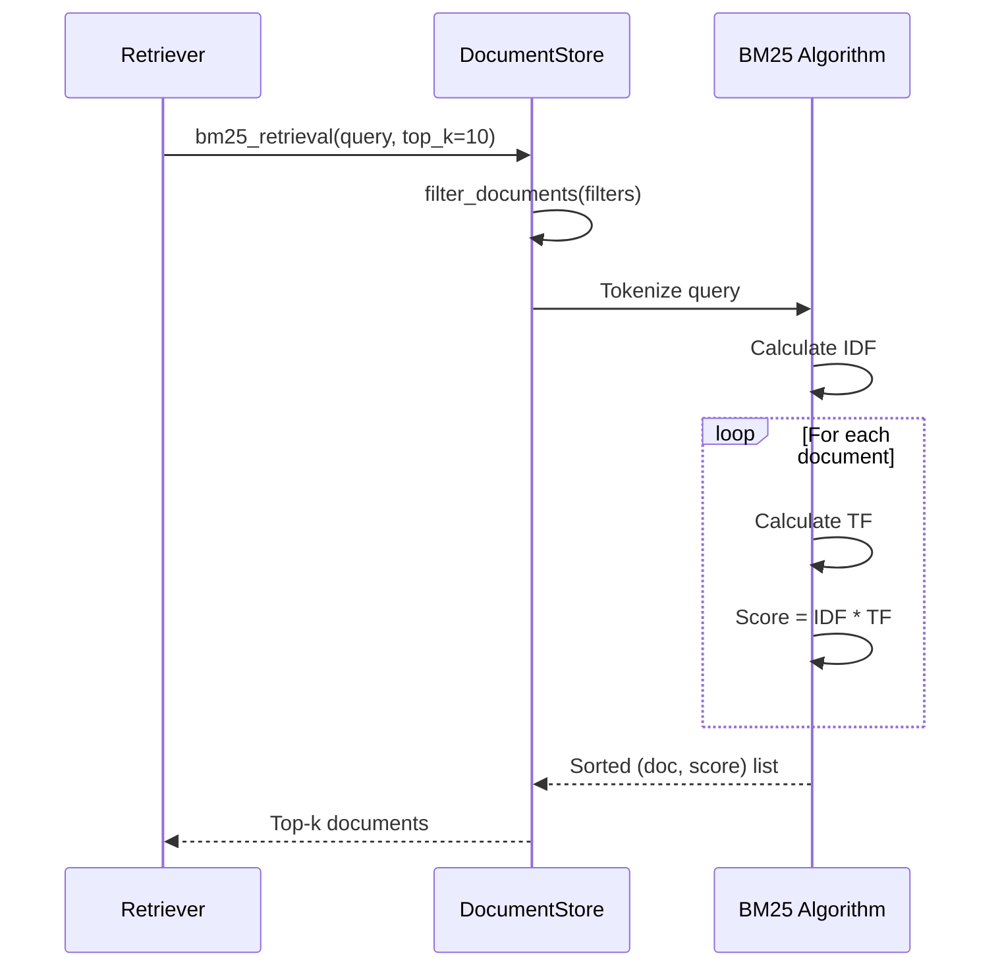
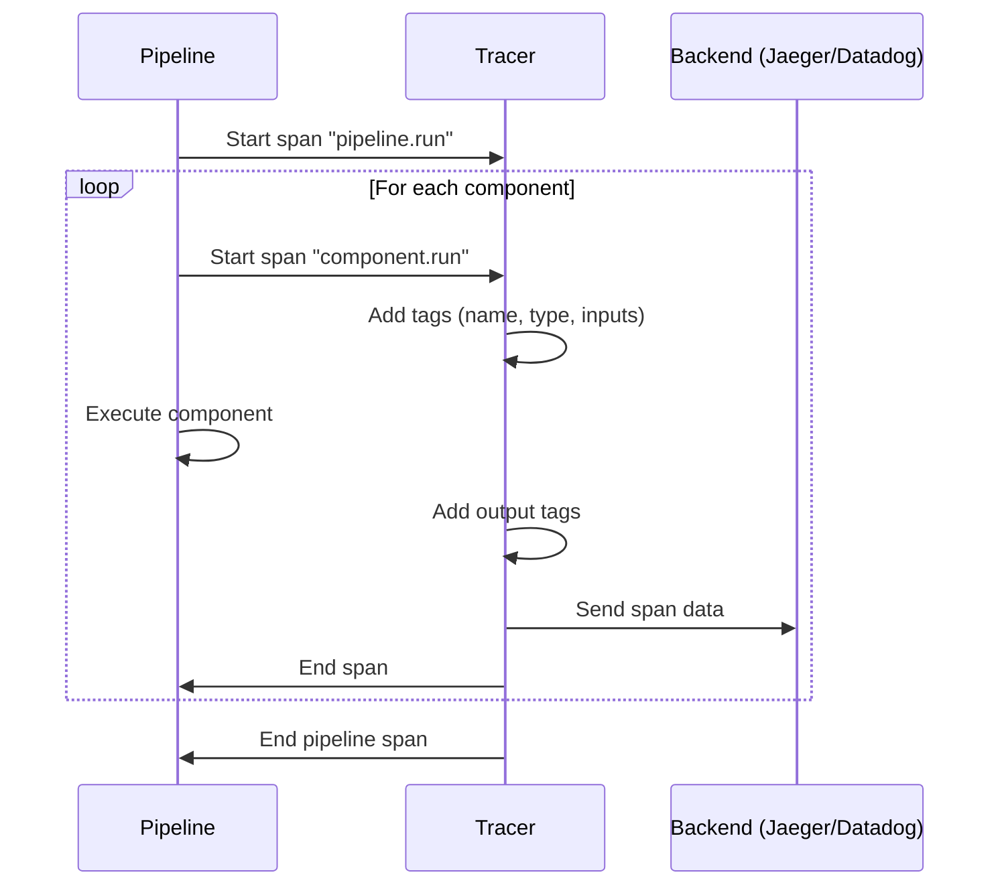
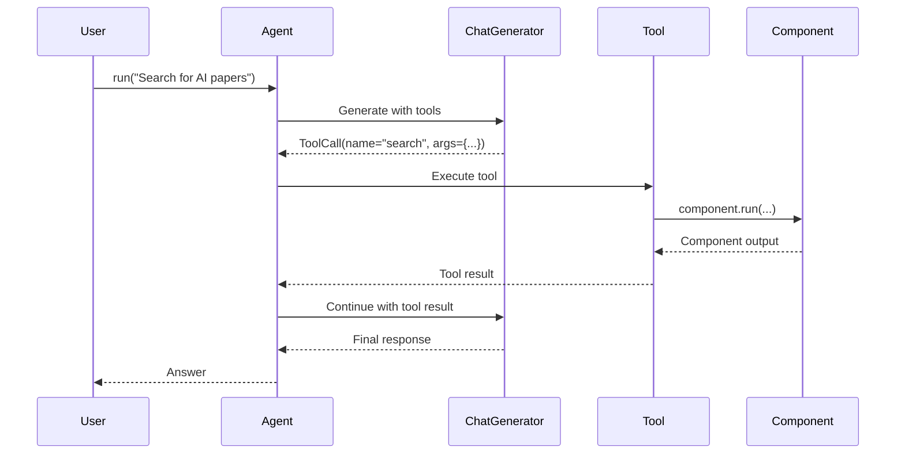

# Infrastructure Layer

## Tổng quan

Infrastructure Layer cung cấp các dịch vụ hỗ trợ cho toàn bộ framework, bao gồm document stores, tools, utilities, tracing, và evaluation.

## Cấu trúc thư mục

```
haystack/
├── document_stores/     # Document storage abstractions
│   ├── types/           # Protocol definitions
│   ├── in_memory/       # In-memory implementation
│   └── errors/          # Exception classes
├── tools/               # Tool definitions cho agents
├── utils/               # Utility functions
├── tracing/             # Distributed tracing
├── evaluation/          # Evaluation framework
├── telemetry/           # Telemetry collection
├── marshal/             # Serialization marshalling
└── logging.py           # Logging configuration
```

---

## Core Components

### 1. Document Stores (`document_stores/`)

File phân tích chi tiết: [document_stores.md](./document_stores.md)

**Mục đích:** Abstraction layer cho document storage với nhiều backends khác nhau.

#### InMemoryDocumentStore

```python
class InMemoryDocumentStore:
    """In-memory document storage với BM25 và embedding retrieval."""

    def __init__(
        self,
        bm25_tokenization_regex: str = r"(?u)\b\w\w+\b",
        bm25_algorithm: Literal["BM25Okapi", "BM25L", "BM25Plus"] = "BM25L",
        embedding_similarity_function: Literal["dot_product", "cosine"] = "dot_product",
        index: Optional[str] = None,
    ): ...

    def write_documents(self, documents: list[Document], policy: DuplicatePolicy) -> int: ...
    def filter_documents(self, filters: Optional[dict]) -> list[Document]: ...
    def bm25_retrieval(self, query: str, top_k: int) -> list[Document]: ...
    def embedding_retrieval(self, query_embedding: list[float], top_k: int) -> list[Document]: ...
    def delete_documents(self, document_ids: list[str]) -> None: ...
```

**Key Features:**
- BM25 retrieval với 3 algorithms: BM25Okapi, BM25L, BM25Plus
- Embedding-based retrieval với dot_product hoặc cosine similarity
- Async support cho tất cả operations
- Serialization với `save_to_disk()` / `load_from_disk()`

**BM25 Retrieval Flow:**


---

### 2. Tools (`tools/`)

File phân tích chi tiết: [tools.md](./tools.md)

**Mục đích:** Định nghĩa tools cho agent systems.

| File | Class/Function | Mô tả |
|------|----------------|-------|
| `tool.py` | `Tool` | Base tool dataclass |
| `component_tool.py` | `ComponentTool` | Wrap component thành tool |
| `pipeline_tool.py` | `PipelineTool` | Wrap pipeline thành tool |
| `toolset.py` | `Toolset` | Collection of tools |
| `from_function.py` | `@tool` | Decorator để tạo tool từ function |
| `serde_utils.py` | Serialization | Tool serialization utilities |

**Tool Definition:**
```python
@dataclass
class Tool:
    name: str
    description: str
    parameters: dict[str, Any]        # JSON Schema
    function: Callable[..., Any]
    inputs_from_state: Optional[list[str]] = None
    outputs_to_state: Optional[list[str]] = None

# Create tool from function
@tool
def search_documents(query: str, top_k: int = 5) -> list[Document]:
    """Search documents by query."""
    ...

# Or using decorator factory
my_tool = create_tool_from_function(search_documents)
```

**ComponentTool & PipelineTool:**
```python
# Wrap component as tool
retriever = InMemoryBM25Retriever(document_store=store)
retriever_tool = ComponentTool(
    component=retriever,
    name="search",
    description="Search documents"
)

# Wrap pipeline as tool
pipeline_tool = PipelineTool(
    pipeline=rag_pipeline,
    name="answer_question",
    description="Answer questions using RAG"
)
```

---

### 3. Utilities (`utils/`)

**Mục đích:** Utility functions được sử dụng xuyên suốt framework.

| File | Function/Class | Mô tả |
|------|----------------|-------|
| `auth.py` | `Secret` | Quản lý credentials an toàn |
| `device.py` | `Device`, `DeviceType` | Device management (CPU/GPU) |
| `url_validation.py` | URL validation | Validate URLs |
| `requests_utils.py` | `request_with_retry()` | HTTP requests với retry logic |
| `type_serialization.py` | Type serialization | Serialize/deserialize types |
| `callable_serialization.py` | Callable serialization | Serialize functions |
| `filters.py` | `document_matches_filter()` | Document filtering |
| `jupyter.py` | `is_in_jupyter()` | Detect Jupyter environment |

**Secret Management:**
```python
from haystack.utils import Secret

# Create secret from environment variable
api_key = Secret.from_env_var("OPENAI_API_KEY")

# Create secret from token
api_key = Secret.from_token("sk-...")

# Resolve secret value
actual_key = api_key.resolve_value()
```

**Device Management:**
```python
from haystack.utils import Device, DeviceType

# Automatic device selection
device = Device.resolve_device()

# Specific device
device = Device(DeviceType.GPU, device_id=0)
device = Device(DeviceType.CPU)
```

---

### 4. Tracing (`tracing/`)

**Mục đích:** Distributed tracing và observability.

| File | Class | Mô tả |
|------|-------|-------|
| `tracer.py` | `Tracer` | Base tracer interface |
| `opentelemetry.py` | `OpenTelemetryTracer` | OpenTelemetry integration |
| `datadog.py` | `DatadogTracer` | Datadog APM integration |
| `langfuse.py` | `LangfuseTracer` | Langfuse integration |

**Usage:**
```python
from haystack import tracing

# Enable tracing
tracing.tracer.trace(
    "haystack.component.run",
    tags={
        "haystack.component.name": "retriever",
        "haystack.component.type": "InMemoryBM25Retriever"
    }
)
```

**Tracing Flow:**


---

### 5. Evaluation (`evaluation/`)

**Mục đích:** Evaluation metrics và result tracking.

```python
@dataclass
class EvaluationRunResult:
    """Stores results from an evaluation run."""

    run_name: str
    inputs: dict[str, list[Any]]
    results: dict[str, dict[str, Any]]
    evaluated_at: datetime

    def to_pandas(self) -> "DataFrame": ...
    def score_report(self) -> "DataFrame": ...
```

---

### 6. Logging (`logging.py`)

**Mục đích:** Structured logging với structlog.

```python
from haystack import logging

logger = logging.getLogger(__name__)
logger.info(
    "Processing document",
    document_id="doc_123",
    content_length=500
)

# Configure logging level
logging.configure_logging(use_json=True, level="DEBUG")
```

---

## Design Patterns Sử Dụng

### 1. Protocol Pattern (Duck Typing)
```python
# document_stores/types/
class DuplicatePolicy(Enum):
    NONE = "none"
    SKIP = "skip"
    OVERWRITE = "overwrite"
    FAIL = "fail"

# Document store protocol
class DocumentStore(Protocol):
    def count_documents(self) -> int: ...
    def filter_documents(self, filters: dict) -> list[Document]: ...
    def write_documents(self, documents: list[Document]) -> int: ...
    def delete_documents(self, document_ids: list[str]) -> None: ...
```

### 2. Factory Pattern
```python
# Create tools from functions
tool = create_tool_from_function(my_function)

# Create secret from env var
secret = Secret.from_env_var("API_KEY")
```

### 3. Adapter Pattern
```python
# ComponentTool adapts Component to Tool interface
class ComponentTool(Tool):
    def __init__(self, component: Component, name: str, description: str):
        self.component = component
        # Adapt component.run() to tool.function
```

### 4. Singleton Pattern (Global Storage)
```python
# InMemoryDocumentStore uses global storage
_STORAGES: dict[str, dict[str, Document]] = {}

class InMemoryDocumentStore:
    @property
    def storage(self) -> dict[str, Document]:
        return _STORAGES.get(self.index, {})
```

---

## Luồng Xử Lý Agent với Tools



---

## Mối Quan Hệ Giữa Infrastructure Components

```
┌─────────────────────────────────────────────────────────────┐
│                      Components                              │
│  (Retrievers, Generators, Agents, ...)                      │
└─────────────────────────┬───────────────────────────────────┘
                          │
          ┌───────────────┼───────────────┐
          ▼               ▼               ▼
    ┌───────────┐  ┌─────────────┐  ┌───────────┐
    │ Document  │  │   Tools     │  │  Tracing  │
    │  Stores   │  │  Toolsets   │  │           │
    └─────┬─────┘  └──────┬──────┘  └─────┬─────┘
          │               │               │
          └───────────────┼───────────────┘
                          ▼
                   ┌─────────────┐
                   │  Utilities  │
                   │ (Secret,    │
                   │  Device,    │
                   │  Filters)   │
                   └─────────────┘
```

---

## Files Phân Tích Chi Tiết

- [document_stores.md](./document_stores.md) - Phân tích Document Stores
- [tools.md](./tools.md) - Phân tích Tool system
- [tracing.md](./tracing.md) - Phân tích Tracing
- [utils.md](./utils.md) - Phân tích Utilities
