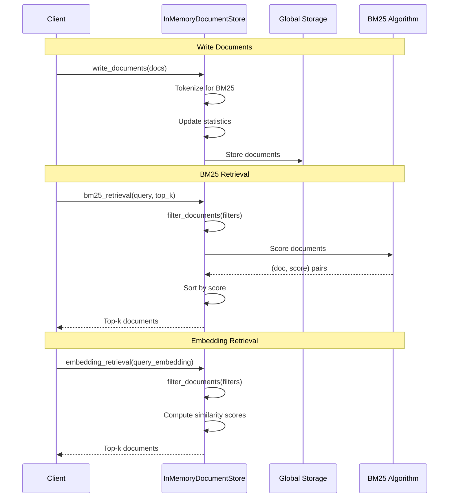
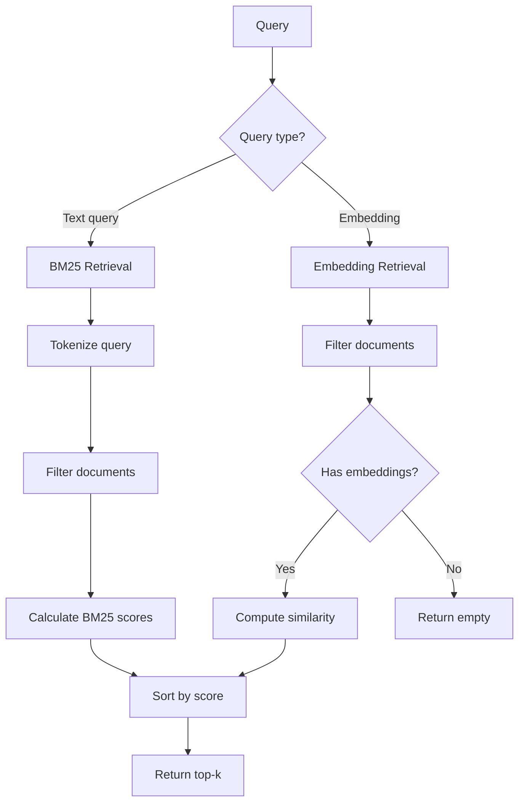

# Document Stores - Phân Tích Chi Tiết

## Tổng quan

Document Store là abstraction layer cho việc lưu trữ và truy vấn documents. Haystack cung cấp `InMemoryDocumentStore` làm reference implementation.

**File:** `haystack/document_stores/in_memory/document_store.py`

---

## Sequence Diagram - Document Store Operations



---

## Class `InMemoryDocumentStore`

**Vị trí:** Line 58-767

### Constructor

```python
def __init__(
    self,
    bm25_tokenization_regex: str = r"(?u)\b\w\w+\b",  # Word tokenizer
    bm25_algorithm: Literal["BM25Okapi", "BM25L", "BM25Plus"] = "BM25L",
    bm25_parameters: Optional[dict] = None,  # k1, b, delta, epsilon
    embedding_similarity_function: Literal["dot_product", "cosine"] = "dot_product",
    index: Optional[str] = None,  # Storage index (UUID if not provided)
    async_executor: Optional[ThreadPoolExecutor] = None,
    return_embedding: bool = True,
):
```

**Global Storage:**

```python
# Line 52-55: Global storage shared across instances
_STORAGES: dict[str, dict[str, Document]] = {}
_BM25_STATS_STORAGES: dict[str, dict[str, BM25DocumentStats]] = {}
_AVERAGE_DOC_LEN_STORAGES: dict[str, float] = {}
_FREQ_VOCAB_FOR_IDF_STORAGES: dict[str, Counter] = {}
```

**Giải thích:**
- Multiple instances có thể share storage qua `index`
- BM25 statistics được cache để tăng performance

---

### BM25 Algorithms

**BM25DocumentStats:**

```python
@dataclass
class BM25DocumentStats:
    freq_token: dict[str, int]  # Token frequencies
    doc_len: int                 # Document length
```

#### BM25L Algorithm

**Vị trí:** Line 192-237

```python
def _score_bm25l(self, query: str, documents: list[Document]) -> list[tuple[Document, float]]:
    k = self.bm25_parameters.get("k1", 1.5)
    b = self.bm25_parameters.get("b", 0.75)
    delta = self.bm25_parameters.get("delta", 0.5)

    def _compute_idf(tokens: list[str]) -> dict[str, float]:
        """IDF = log((N + 1) / (n + 0.5))"""
        idf = {}
        n_corpus = len(self._bm25_attr)
        for tok in tokens:
            n = self._freq_vocab_for_idf.get(tok, 0)
            idf[tok] = math.log((n_corpus + 1.0) / (n + 0.5)) * int(n != 0)
        return idf

    def _compute_tf(token: str, freq: dict, doc_len: int) -> float:
        """TF with length normalization."""
        freq_term = freq.get(token, 0.0)
        ctd = freq_term / (1 - b + b * doc_len / self._avg_doc_len)
        return (1.0 + k) * (ctd + delta) / (k + ctd + delta)

    # Score = sum(IDF * TF) for each query token
    idf = _compute_idf(self._tokenize_bm25(query))
    ret = []
    for doc in documents:
        score = sum(idf[tok] * _compute_tf(tok, ...) for tok in idf.keys())
        ret.append((doc, score))
    return ret
```

#### BM25Okapi Algorithm

**Vị trí:** Line 239-295

```python
def _score_bm25okapi(self, query: str, documents: list[Document]) -> list[tuple[Document, float]]:
    # Similar to BM25L but with different IDF formula
    # IDF = log((N - n + 0.5) / (n + 0.5))
    # Can return negative scores (handled specially)
    ...
```

#### BM25Plus Algorithm

**Vị trí:** Line 297-345

```python
def _score_bm25plus(self, query: str, documents: list[Document]) -> list[tuple[Document, float]]:
    # IDF = log(1 + (N - n + 0.5) / (n + 0.5))
    # TF includes delta term for better handling of long documents
    ...
```

---

### Core Methods

#### `write_documents`

**Vị trí:** Line 443-484

```python
def write_documents(
    self,
    documents: list[Document],
    policy: DuplicatePolicy = DuplicatePolicy.NONE
) -> int:
    if policy == DuplicatePolicy.NONE:
        policy = DuplicatePolicy.FAIL

    written_documents = len(documents)
    for document in documents:
        # Handle duplicates
        if policy != DuplicatePolicy.OVERWRITE and document.id in self.storage:
            if policy == DuplicatePolicy.FAIL:
                raise DuplicateDocumentError(f"ID '{document.id}' already exists.")
            if policy == DuplicatePolicy.SKIP:
                written_documents -= 1
                continue

        # Remove existing for overwrite
        if document.id in self.storage:
            self.delete_documents([document.id])

        # Tokenize and update BM25 stats
        tokens = []
        if document.content is not None:
            tokens = self._tokenize_bm25(document.content)

        # Store document
        self.storage[document.id] = document

        # Update statistics
        self._bm25_attr[document.id] = BM25DocumentStats(Counter(tokens), len(tokens))
        self._freq_vocab_for_idf.update(set(tokens))
        self._avg_doc_len = (len(tokens) + self._avg_doc_len * len(self._bm25_attr)) / (len(self._bm25_attr) + 1)

    return written_documents
```

**DuplicatePolicy:**
- `FAIL`: Raise exception nếu duplicate
- `SKIP`: Skip duplicate documents
- `OVERWRITE`: Replace existing documents

#### `bm25_retrieval`

**Vị trí:** Line 508-564

```python
def bm25_retrieval(
    self,
    query: str,
    filters: Optional[dict] = None,
    top_k: int = 10,
    scale_score: bool = False
) -> list[Document]:
    if not query:
        raise ValueError("Query should be a non-empty string")

    # Filter documents with content
    content_type_filter = {"field": "content", "operator": "!=", "value": None}
    if filters:
        filters = {"operator": "AND", "conditions": [content_type_filter, filters]}
    else:
        filters = content_type_filter

    all_documents = self.filter_documents(filters=filters)
    if len(all_documents) == 0:
        return []

    # Score and sort
    results = sorted(
        self.bm25_algorithm_inst(query, all_documents),
        key=lambda x: x[1],
        reverse=True
    )[:top_k]

    # Scale scores if requested
    return_documents = []
    for doc, score in results:
        if scale_score:
            score = expit(score / BM25_SCALING_FACTOR)
        if score <= 0.0:
            continue
        doc_fields = doc.to_dict()
        doc_fields["score"] = score
        return_documents.append(Document.from_dict(doc_fields))

    return return_documents
```

#### `embedding_retrieval`

**Vị trí:** Line 566-628

```python
def embedding_retrieval(
    self,
    query_embedding: list[float],
    filters: Optional[dict] = None,
    top_k: int = 10,
    scale_score: bool = False,
    return_embedding: Optional[bool] = False,
) -> list[Document]:
    if len(query_embedding) == 0:
        raise ValueError("query_embedding should be a non-empty list of floats.")

    # Filter documents
    all_documents = self.filter_documents(filters=filters) if filters else list(self.storage.values())

    # Only documents with embeddings
    documents_with_embeddings = [doc for doc in all_documents if doc.embedding is not None]

    # Compute similarity scores
    scores = self._compute_query_embedding_similarity_scores(
        embedding=query_embedding,
        documents=documents_with_embeddings,
        scale_score=scale_score
    )

    # Sort and return top_k
    top_documents = []
    for doc, score in sorted(zip(documents_with_embeddings, scores), key=lambda x: x[1], reverse=True)[:top_k]:
        doc_fields = doc.to_dict()
        doc_fields["score"] = score
        top_documents.append(Document.from_dict(doc_fields))

    return top_documents
```

#### `_compute_query_embedding_similarity_scores`

**Vị trí:** Line 629-678

```python
def _compute_query_embedding_similarity_scores(
    self,
    embedding: list[float],
    documents: list[Document],
    scale_score: bool = False
) -> list[float]:
    query_embedding = np.array(embedding)
    document_embeddings = np.array([doc.embedding for doc in documents])

    if self.embedding_similarity_function == "cosine":
        # Normalize vectors for cosine similarity
        query_embedding /= np.linalg.norm(query_embedding, axis=1, keepdims=True)
        document_embeddings /= np.linalg.norm(document_embeddings, axis=1, keepdims=True)

    # Dot product similarity
    scores = np.dot(query_embedding, document_embeddings.T)[0].tolist()

    # Scale scores
    if scale_score:
        if self.embedding_similarity_function == "dot_product":
            scores = [expit(score / DOT_PRODUCT_SCALING_FACTOR) for score in scores]
        elif self.embedding_similarity_function == "cosine":
            scores = [(score + 1) / 2 for score in scores]

    return scores
```

---

### Persistence

#### `save_to_disk`

**Vị trí:** Line 376-385

```python
def save_to_disk(self, path: str) -> None:
    """Save store as JSON file."""
    data = self.to_dict()
    data["documents"] = [doc.to_dict(flatten=False) for doc in self.storage.values()]
    with open(path, "w") as f:
        json.dump(data, f)
```

#### `load_from_disk`

**Vị trí:** Line 387-410

```python
@classmethod
def load_from_disk(cls, path: str) -> "InMemoryDocumentStore":
    """Load store from JSON file."""
    with open(path, "r") as f:
        data = json.load(f)

    documents = data.pop("documents")
    cls_object = default_from_dict(cls, data)
    cls_object.write_documents(
        documents=[Document(**doc) for doc in documents],
        policy=DuplicatePolicy.OVERWRITE
    )
    return cls_object
```

---

## Flowchart - Retrieval Decision



---

## Ví Dụ Sử Dụng

### Basic Usage

```python
from haystack.document_stores.in_memory import InMemoryDocumentStore
from haystack.dataclasses import Document

# Create store
store = InMemoryDocumentStore(
    bm25_algorithm="BM25L",
    embedding_similarity_function="cosine"
)

# Add documents
docs = [
    Document(content="Haystack is an LLM framework."),
    Document(content="It supports RAG pipelines."),
]
store.write_documents(docs)

# BM25 search
results = store.bm25_retrieval("What is Haystack?", top_k=5)

# Embedding search (after adding embeddings)
results = store.embedding_retrieval(
    query_embedding=[0.1, 0.2, ...],
    top_k=5
)
```

### With Filters

```python
results = store.bm25_retrieval(
    query="Haystack",
    filters={
        "operator": "AND",
        "conditions": [
            {"field": "meta.source", "operator": "==", "value": "docs"}
        ]
    },
    top_k=10
)
```

### Persistence

```python
# Save to disk
store.save_to_disk("my_store.json")

# Load from disk
loaded_store = InMemoryDocumentStore.load_from_disk("my_store.json")
```

### Shared Index

```python
# Multiple instances sharing same storage
store1 = InMemoryDocumentStore(index="shared_index")
store2 = InMemoryDocumentStore(index="shared_index")

store1.write_documents([doc1])
# doc1 is now accessible from store2
```

---

## Dependencies

### Used by Components

| Component | Method Used |
|-----------|-------------|
| `InMemoryBM25Retriever` | `bm25_retrieval()` |
| `InMemoryEmbeddingRetriever` | `embedding_retrieval()` |
| `DocumentWriter` | `write_documents()` |
| `FilterRetriever` | `filter_documents()` |
